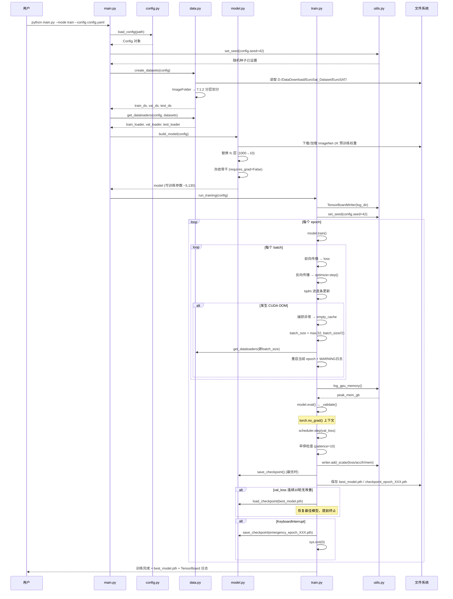
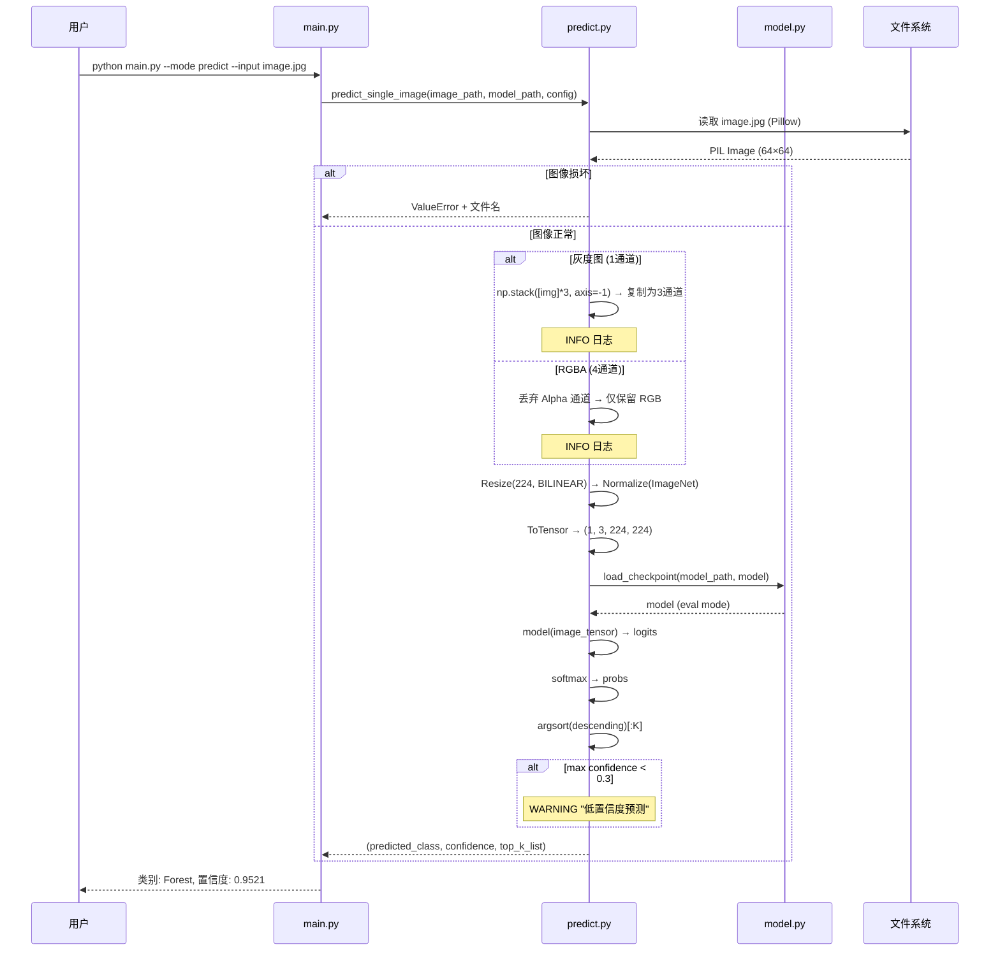

# 基于深度学习的卫星影像分类系统 — 概要设计说明书

> **文档编号**：ADS-EuroSAT-001  
> **版本**：v1.0.0  
> **编制日期**：2026-06-16  
> **编制依据**：GB/T 8567-2006 第 7.3 节 "概要设计说明 (ADS)"  
> **项目版本**：EuroSAT_Classification v1.0.0  
> **关联文档**：卫星影像分类需求规格说明书V1.0.md、卫星影像分类技术选型方案V1.0.md

---

## 修改记录

| 版本 | 日期 | 修改内容 | 修改人 |
|------|------|---------|--------|
| v1.0.0 | 2026-06-16 | 初稿：基于SRS V1.0和技术选型V1.0，完成8模块架构设计、10个接口定义、3个核心流程、5项风险分析 | — |

---

## 目录

- [1. 引言](#1-引言)
- [2. 总体设计](#2-总体设计)
- [3. 架构设计](#3-架构设计)
- [4. 模块设计](#4-模块设计)
- [5. 数据设计](#5-数据设计)
- [6. 接口设计](#6-接口设计)
- [7. 人机界面设计](#7-人机界面设计)
- [8. 运行设计](#8-运行设计)
- [9. 出错处理设计](#9-出错处理设计)
- [10. 安全设计](#10-安全设计)
- [11. 维护设计](#11-维护设计)
- [12. 技术与设计风险分析](#12-技术与设计风险分析)
- [13. 设计决策记录](#13-设计决策记录)
- [14. 自我审查](#14-自我审查)
- [附录A 需求追溯](#附录a-需求追溯)
- [附录B 顶层目录结构设计](#附录b-顶层目录结构设计)

---

## 1. 引言

### 1.1 编写目的

本文档是 EuroSAT_Classification 卫星影像分类系统的概要设计说明（Architectural Design Specification, ADS），依据 GB/T 8567-2006 第 7.3 节编制。用于：

1. 描述系统的整体架构、模块划分和全局接口
2. 作为详细设计（DDS）和编码实现的顶层依据
3. 为集成测试和系统测试提供架构级参考

### 1.2 适用范围

- **开发人员**：理解系统架构与模块职责，进行编码实现
- **架构审查者**：评估架构设计的合理性和完整性
- **测试人员**：理解模块边界，设计集成测试用例
- **维护人员**：理解系统结构，定位问题和扩展功能

### 1.3 术语定义

| 术语 | 定义 |
|------|------|
| ADS | Architectural Design Specification，概要设计说明 |
| DDS | Detailed Design Specification，详细设计说明 |
| EuroSAT | European Satellite Dataset，Sentinel-2 卫星影像土地覆盖分类数据集 |
| ResNet18 | 18 层残差卷积神经网络，本项目主选分类模型 |
| 迁移学习 | 冻结预训练骨干网络，仅训练分类头的训练策略 |
| GSD | Ground Sampling Distance，地面采样距离（10 m/像素） |
| CE Loss | Cross Entropy Loss，交叉熵损失函数 |

### 1.4 参考文档

| 文档 | 路径 | 说明 |
|------|------|------|
| 需求规格说明书 V1.0 | [卫星影像分类需求规格说明书V1.0.md](卫星影像分类需求规格说明书V1.0.md) | REQ-SPEC-EuroSAT-001 |
| 技术选型方案 V1.0 | [卫星影像分类技术选型方案V1.0.md](卫星影像分类技术选型方案V1.0.md) | TECH-SELECT-EuroSAT-001 |
| GB/T 8567-2006 | 国家标准 | 计算机软件文档编制规范 |

---

## 2. 总体设计

### 2.1 设计原则

| 原则 | 说明 |
|------|------|
| **显存优先** | 所有设计决策以"训练峰值显存 ≤ 3.0 GB"为硬约束；batch=256 时实际显存约 1.5 GB，余量充足 |
| **模块化** | 8 模块独立开发，单向依赖（上层 → 下层），无循环引用 |
| **配置驱动** | 所有可变参数通过 YAML 配置，代码零硬编码；命令行参数可覆盖配置文件值 |
| **可复现** | 固定随机种子（seed=42）+ 配置快照自动保存，确保实验结果完全一致 |
| **容错设计** | OOM 自动恢复（降 batch_size）、中断紧急保存、异常分类处理 |
| **简洁优先** | 在满足需求的前提下选择最简单方案：不启用 AMP（无收益）、不引入第三方增强库（torchvision 足够） |

### 2.2 运行环境

| 项目 | 版本/规格 | 说明 |
|------|----------|------|
| 操作系统 | Windows 10/11 64-bit | 主开发与运行环境；兼容 Linux |
| Python | 3.8.20 | `requirements.txt` 精确锁定 |
| PyTorch | 1.12.1+cu113 | CUDA 11.3 官方 Wheel |
| TorchVision | 0.13.1+cu113 | 预训练模型 + 数据集接口 |
| CUDA Toolkit | 11.3 | GPU 驱动 ≥ 465.x |
| GPU | NVIDIA GTX 1050 Ti 4 GB | Pascal 架构，计算能力 6.1 |
| cuDNN | 8.2+ | CUDA 11.3 配套版本 |

### 2.3 技术栈

详见 [卫星影像分类技术选型方案V1.0.md](卫星影像分类技术选型方案V1.0.md) 第 10 章选型汇总。核心技术栈：

| 层级 | 技术 | 版本 |
|------|------|------|
| 深度学习框架 | PyTorch + TorchVision | 1.12.1+cu113 / 0.13.1 |
| 编程语言 | Python | 3.8.20 |
| 图像处理 | Pillow + torchvision.transforms | 9.x / 内置 |
| 数值计算 | NumPy | 1.21+ |
| 训练监控 | TensorBoard (SummaryWriter) | 2.9+ |
| 可视化 | Matplotlib + Seaborn | 3.5+ / 0.11+ |
| 进度条 | tqdm | 4.64+ |
| 配置管理 | PyYAML | 6.0+ |
| 数据处理 | pandas | 1.3+ |
| 指标验证 | scikit-learn | 1.0+（备选） |

### 2.4 系统约束

| 约束项 | 指标 | 依据 |
|--------|------|------|
| 训练峰值显存 | ≤ 3.0 GB（batch=256, 224×224, FP32） | SRS NFR-P1 |
| 模型参数量 | ≤ 12M（ResNet18 约 11.7M） | SRS 技术约束 |
| 单张推理耗时 | ≤ 50 ms（GPU, 含预处理） | SRS NFR-P2 |
| 训练总耗时 | ≤ 50 分钟（50 epochs） | SRS NFR-P5 |
| 输入尺寸 | 64×64 → 224×224（BILINEAR 上采样） | SRS 技术约束 |
| 批大小 | 256（训练/验证/测试） | SRS 技术约束 |

---

## 3. 架构设计

### 3.1 层次划分

系统采用经典四层架构，依赖方向严格自上而下：

```
┌─────────────────────────────────────────────────────────────┐
│                    表 示 层 (Presentation)                    │
│  main.py                                                      │
│  职责：CLI 参数解析 → 模式路由 → 调用应用层 → 结果输出       │
│  模式：train | evaluate | predict | check                     │
├─────────────────────────────────────────────────────────────┤
│                    应 用 层 (Application)                     │
│  train.py              evaluate.py          predict.py        │
│  职责：训练编排          职责：评估编排        职责：推理编排  │
│       训练循环+验证           指标计算+报告          预处理+预测 │
│       早停+LR调度            混淆矩阵+分析          批量+汇总   │
├─────────────────────────────────────────────────────────────┤
│                    领 域 层 (Domain)                           │
│  model.py              data.py              utils.py          │
│  职责：模型构建+损失     职责：数据全流程       职责：通用工具  │
│       预训练加载             加载+划分+上采样       日志+可视化  │
│       分类头替换             增强+标准化           GPU监控      │
│       冻结/解冻控制         DataLoader封装        进度条封装    │
├─────────────────────────────────────────────────────────────┤
│               基 础 设 施 层 (Infrastructure)                  │
│  config.py                                                  │
│  职责：YAML 加载/校验/后处理 → 不可变 Config 对象              │
│        配置快照保存、命令行参数覆盖                            │
└─────────────────────────────────────────────────────────────┘
```

**依赖原则**：上层可依赖下层；下层不可依赖上层；领域层仅依赖基础设施层（data/model/utils 仅依赖 config）；同层模块通过应用层协调（train/evaluate/predict 调用 data/model/utils），不直接相互调用。

### 3.2 组件图

```
                    ┌──────────────┐
                    │   main.py    │
                    │  (CLI 入口)   │
                    └──┬───┬───┬──┘
                       │   │   │
              ┌────────▼┐ ┌▼───────┐ ┌▼──────────┐
              │ train   │ │evaluate│ │ predict    │
              │ .py     │ │.py     │ │ .py        │
              └──┬──┬───┘ └┬──┬───┘ └┬────┬─────┘
                 │  │      │  │      │    │
        ┌────────▼┐ │ ┌────▼──▼──┐ ┌▼────▼──────┐
        │ model   │ │ │  data    │ │  utils     │
        │ .py     │ │ │  .py     │ │  .py       │
        └─────────┘ │ └──────────┘ └────────────┘
                    │
              ┌─────▼──────┐
              │  config    │
              │  .py       │
              └────────────┘
```

### 3.3 数据流

#### 训练数据流

```
config.yaml ──→ config.py ──→ Config 对象
                                   │
EuroSAT/类别文件夹 ──→ data.py ──→ train_loader ──→ train.py ──→ model.py
  (10个子目录)            │           (batch=256)         │
                          ▼                               ▼
                    ImageFolder                  checkpoints/
                    7:1:2 分层划分                best_model.pth
                    64→224 BILINEAR               checkpoint_epoch_XXX.pth
                    ImageNet 标准化                    │
                    数据增强(仅训练)        logs/ ◄── TensorBoard
                    DataLoader 封装         runs/ ◄── 配置快照
```

#### 推理数据流

```
影像 .jpg/.png ──→ predict.py ──→ 预处理 ──→ model 推理
   (64×64)            │           (224×224      (softmax)
                      │           标准化)           │
                      │                            ▼
                      │                       Top-K 预测
                      │                   (类别+置信度)
                      │                            │
                      ├────────────────────────────┘
                      │
          ┌───────────┼───────────┐
          ▼           ▼           ▼
    outputs/     控制台输出     CSV 文件
  (单张可视化)  (类别+置信度)  (批量结果)
```

---

## 4. 模块设计

### 4.1 data 模块

| 属性 | 说明 |
|------|------|
| **代码文件** | `data.py`（~250 行） |
| **核心职责** | EuroSAT 数据集加载、7:1:2 分层划分、64→224 BILINEAR 上采样、ImageNet 标准化、数据增强管线、DataLoader 封装 |
| **依赖** | PyTorch、TorchVision、Pillow、NumPy、config 模块 |
| **对应 FR** | FR-1（数据加载与预处理）、FR-2（数据增强） |

**内部组件**：

| 组件 | 类型 | 说明 |
|------|------|------|
| `EuroSATDataset` | `class(Dataset)` | 核心数据集类：封装 `ImageFolder` → `__len__` + `__getitem__` |
| `_build_train_transform(config)` | 函数 | 构建训练增强流水线：Resize(224, BILINEAR) → RandomHorizontalFlip(p=0.5) → RandomRotation(±15°) → ColorJitter(brightness=0.2, contrast=0.2) → Normalize(ImageNet) → ToTensor() |
| `_build_eval_transform(config)` | 函数 | 构建评估推理流水线（无增强）：Resize(224, BILINEAR) → Normalize(ImageNet) → ToTensor() |
| `create_datasets(config)` | 函数 | 工厂函数：加载 EuroSAT 根目录 → 7:1:2 分层划分（seed=42）→ 实例化 train/val/test 三个 Dataset |
| `get_dataloaders(config, datasets)` | 函数 | 封装 DataLoader：train（shuffle=True, batch=256, num_workers=4, pin_memory=True）；val/test（shuffle=False, batch=256） |

**公开接口**（详见第 6 章接口设计）：

- `create_datasets(config: Config) -> tuple[Dataset, Dataset, Dataset]`
- `get_dataloaders(config: Config, datasets: tuple) -> tuple[DataLoader, DataLoader, DataLoader]`

**关键行为**：

1. 数据加载：`torchvision.datasets.ImageFolder` 自动按文件夹名（字母序）映射标签 0~9
2. 分层划分：`sklearn.model_selection.train_test_split` 按 7:1:2 比例分层采样，确保各类别在三个子集中比例一致
3. 上采样：64×64 使用 `transforms.Resize(224, InterpolationMode.BILINEAR)` 匹配 ResNet18 预期输入
4. 标准化：ImageNet 均值 (0.485, 0.456, 0.406) / 标准差 (0.229, 0.224, 0.225)，与预训练权重一致
5. 增强仅在训练集执行；验证/测试集仅 Resize + Normalize

---

### 4.2 model 模块

| 属性 | 说明 |
|------|------|
| **代码文件** | `model.py`（~150 行） |
| **核心职责** | ResNet18 加载 ImageNet 预训练权重、分类头替换（1000→10 类）、骨干网络冻结/解冻控制、CrossEntropyLoss 定义、checkpoint 存取 |
| **依赖** | PyTorch、TorchVision、config 模块 |
| **对应 FR** | FR-3（模型构建与迁移学习） |

**内部组件**：

| 组件 | 类型 | 说明 |
|------|------|------|
| `build_model(config)` | 函数 | `torchvision.models.resnet18(weights='IMAGENET1K_V1')` → 替换 `model.fc = nn.Linear(512, 10)` → 冻结骨干 → `.cuda()` → 返回模型 |
| `freeze_backbone(model)` | 函数 | 设置除 `model.fc` 外所有参数的 `requires_grad=False`，可训练参数约 5,130 |
| `unfreeze_layers(model, n_layers)` | 函数 | 解冻最后 N 个残差块（1=layer4, 2=layer3+4, ...） |
| `get_loss_fn()` | 函数 | 返回 `nn.CrossEntropyLoss()` |
| `save_checkpoint(model, optimizer, epoch, metrics, path, config)` | 函数 | 保存 state_dict + 训练元信息 |
| `load_checkpoint(path, model, optimizer)` | 函数 | 加载检查点 → 恢复 model/optimizer state → 返回 epoch, metrics |

**检查点字典结构**：

```python
{
    'epoch': int,
    'model_state_dict': dict,
    'optimizer_state_dict': dict,
    'best_val_acc': float,
    'config': dict,               # 训练配置快照
}
```

**公开接口**（详见第 6 章）：

- `build_model(config: Config) -> nn.Module`
- `save_checkpoint(model, optimizer, epoch, metrics, path, config) -> None`
- `load_checkpoint(path, model, optimizer) -> tuple[int, dict]`

---

### 4.3 train 模块

| 属性 | 说明 |
|------|------|
| **代码文件** | `train.py`（~350 行） |
| **核心职责** | 训练循环编排：前向→反向→优化器步进；验证集评估（no_grad）；早停判断与最佳模型保存；学习率调度（ReduceLROnPlateau）；OOM 恢复与紧急检查点；TensorBoard 指标记录 |
| **依赖** | PyTorch、TensorBoard、tqdm、config/data/model/utils 模块 |
| **对应 FR** | FR-4（模型训练） |

**内部组件**：

| 组件 | 类型 | 说明 |
|------|------|------|
| `Trainer` | `class` | 封装训练状态与逻辑 |
| `run_training(config)` | 函数 | 训练入口：创建组件 → 实例化 Trainer → 调用 `trainer.run()` |

**Trainer 关键方法**：

| 方法 | 说明 |
|------|------|
| `__init__(config, model, train_loader, val_loader, optimizer, scheduler, criterion)` | 初始化：计数器、best_val_acc=0、SummaryWriter |
| `_train_one_epoch()` | 训练循环：前向 → loss → 反向 → optimizer.step() → 进度条更新 |
| `_validate()` | 验证循环：`torch.no_grad()` → 累加 loss + correct 计数 → 计算 Accuracy |
| `run()` | 主循环 epochs 次：训练 → 验证 → 日志 → LR调度 → 早停判断 → checkpoint → TensorBoard |

**关键机制**：

- **优化器**：AdamW（lr=1e-4, weight_decay=5e-4），仅更新可训练参数（分类头~5K）
- **学习率调度**：`ReduceLROnPlateau(optimizer, mode='min', patience=5, factor=0.5)` 监控 val_loss
- **早停**：连续 10 epoch val_loss 无改善（min_delta=1e-3）→ 自动停止 → 加载最佳模型
- **最佳保存**：val_accuracy 历史最佳时覆盖保存 `best_model.pth`
- **定期保存**：每 10 epoch 保存 `checkpoint_epoch_XXX.pth`
- **OOM 恢复**：捕获 `RuntimeError("out of memory")` → `batch_size //= 2`（最小 32）→ 重建 DataLoader → 重试当前 epoch
- **紧急检查点**：捕获 `KeyboardInterrupt` → 保存 `emergency_epoch_XXX.pth` → 退出
- **进度条**：tqdm 显示 epoch 进度 + batch loss + 剩余时间

**公开接口**（详见第 6 章）：

- `run_training(config: Config) -> None`

---

### 4.4 evaluate 模块

| 属性 | 说明 |
|------|------|
| **代码文件** | `evaluate.py`（~250 行） |
| **核心职责** | 测试集评估：Accuracy/Precision/Recall/F1/混淆矩阵计算；分类报告生成（含各类别指标+Top-3易混淆类别分析）；误分类样本 CSV 导出 |
| **依赖** | PyTorch、NumPy、pandas、scikit-learn、config/data/model/utils 模块 |
| **对应 FR** | FR-5（模型评估） |

**内部组件**：

| 组件 | 类型 | 说明 |
|------|------|------|
| `_compute_metrics(all_preds, all_labels, class_names)` | 函数 | 累加 TP/FP/FN → 计算 Accuracy + 各类别 Precision/Recall/F1 → 混淆矩阵（sklearn 交叉验证） |
| `_find_confused_pairs(confusion_matrix, class_names, top_k=3)` | 函数 | 识别混淆度最高的前 K 对类别 |
| `_generate_report(metrics, confusion, output_dir)` | 函数 | 生成 Markdown 报告 + 误分类样本 CSV |
| `run_evaluation(config, model_path)` | 函数 | 评估入口：加载模型 → 遍历测试集 → 收集预测 → 计算指标 → 生成报告 |

**评估指标**：

| 指标 | 计算方式 |
|------|---------|
| Top-1 Accuracy | `correct / total` |
| Top-2 Accuracy | 真实标签出现在 Top-2 预测中的比例 |
| Precision (per class) | `TP / (TP + FP)` |
| Recall (per class) | `TP / (TP + FN)` |
| F1-Score (per class) | `2 × Precision × Recall / (Precision + Recall)` |
| 混淆矩阵 | 10×10 归一化矩阵（sklearn） |

**公开接口**（详见第 6 章）：

- `run_evaluation(config: Config, model_path: str) -> dict`

---

### 4.5 predict 模块

| 属性 | 说明 |
|------|------|
| **代码文件** | `predict.py`（~200 行） |
| **核心职责** | 单张/批量卫星影像分类预测；Top-K 类别与置信度输出；灰度图/RGBA 通道自适应；预测结果 CSV 导出与分布统计 |
| **依赖** | PyTorch、Pillow、pandas、config/model 模块 |
| **对应 FR** | FR-6（推理与预测） |

**内部组件**：

| 组件 | 类型 | 说明 |
|------|------|------|
| `_preprocess_image(image_path, config)` | 函数 | 加载图像 → 通道自适应（1→3, RGBA→RGB）→ Resize(224) → Normalize → Tensor |
| `_predict_single(model, image_tensor, top_k)` | 函数 | 前向 → softmax → Top-K 类别索引 + 置信度 |
| `predict_single_image(image_path, model_path, config)` | 函数 | 加载模型 → 预处理 → 预测 → 返回 (类别名, 置信度, top_k 列表) |
| `predict_batch(input_dir, model_path, config)` | 函数 | 遍历文件夹 → 逐张预测 → 汇总 CSV + 类别分布统计 |

**公开接口**（详见第 6 章）：

- `predict_single_image(image_path, model_path, config) -> tuple[str, float, list]`
- `predict_batch(input_dir, model_path, config) -> str`（返回 CSV 路径）

---

### 4.6 config 模块

| 属性 | 说明 |
|------|------|
| **代码文件** | `config.py`（~200 行） |
| **核心职责** | YAML 配置文件加载/校验/后处理 → 不可变 Config 对象；配置快照保存；命令行参数覆盖 |
| **依赖** | PyYAML、dataclasses、pathlib、argparse |
| **对应 FR** | FR-4（训练超参数）、FR-8（CLI 参数） |

**内部组件**：

| 组件 | 类型 | 说明 |
|------|------|------|
| `SystemConfig` | `@dataclass(frozen=True)` | gpu_id, gpu_memory_fraction, num_workers, log_level, output_dir |
| `DataConfig` | `@dataclass(frozen=True)` | root_dir, num_classes, class_names, train_ratio, val_ratio, input_size, original_size |
| `AugmentationConfig` | `@dataclass(frozen=True)` | horizontal_flip, rotation_degrees, brightness, contrast |
| `ModelConfig` | `@dataclass(frozen=True)` | name, pretrained, pretrained_weights, freeze_backbone, unfreeze_layers |
| `TrainConfig` | `@dataclass(frozen=True)` | batch_size, epochs, learning_rate, optimizer, weight_decay, momentum, loss, lr_scheduler, lr_patience, lr_factor, early_stop_patience, early_stop_min_delta, checkpoint_dir, log_dir, save_best_only, save_interval |
| `InferenceConfig` | `@dataclass(frozen=True)` | batch_size, top_k, conf_warning_threshold, output_dir, save_format |
| `VisualizationConfig` | `@dataclass(frozen=True)` | dpi, figsize, cmap, show_values, plot_format |
| `Config` | `@dataclass(frozen=True)` | 顶层聚合：experiment_name, seed + 上述 7 个子配置 |
| `load_config(path, cli_args)` | 函数 | YAML → dict → 递归构造 dataclass → CLI 参数覆盖 → `_validate()` |
| `save_config_snapshot(cfg, dir)` | 函数 | Config → dict → YAML 文件（含时间戳） |

**公开接口**（详见第 6 章）：

- `load_config(path: str, cli_args: dict = None) -> Config`
- `save_config_snapshot(cfg: Config, output_dir: str) -> str`

---

### 4.7 utils 模块

| 属性 | 说明 |
|------|------|
| **代码文件** | `utils.py`（~200 行） |
| **核心职责** | TensorBoard 日志记录；训练曲线图与混淆矩阵热力图生成；类别分布柱状图；tqdm 进度条封装；GPU 显存监控；随机种子设置 |
| **依赖** | PyTorch、TensorBoard、Matplotlib、Seaborn、tqdm、NumPy |
| **对应 FR** | FR-7（训练监控与可视化） |

**内部组件**：

| 组件 | 类型 | 说明 |
|------|------|------|
| `setup_logger(log_dir, level)` | 函数 | 同时输出到控制台和文件，格式含时间戳/级别 |
| `TensorBoardWriter` | `class` | 封装 `SummaryWriter`：`add_scalar` / `add_scalars` / `add_figure` |
| `plot_training_curves(history, output_path)` | 函数 | 训练/验证 loss + accuracy 曲线 → PNG（200 DPI） |
| `plot_confusion_matrix(cm, class_names, output_path)` | 函数 | Seaborn heatmap → 10×10 归一化混淆矩阵 → PNG |
| `plot_class_accuracy(metrics, output_path)` | 函数 | 各类别准确率柱状图，高亮低于平均值的类别 |
| `log_gpu_memory(device)` | 函数 | 读取 `torch.cuda.max_memory_allocated()` / 1024³ → 返回 GB 值 |
| `set_seed(seed)` | 函数 | 设置 random/numpy/torch/torch.cuda 的随机种子 |

**公开接口**（详见第 6 章）：

- `TensorBoardWriter(log_dir)` → 返回 writer 实例
- `plot_training_curves(history, output_path) -> str`
- `plot_confusion_matrix(cm, class_names, output_path) -> str`
- `log_gpu_memory(device) -> float`
- `set_seed(seed: int) -> None`

---

### 4.8 main 模块

| 属性 | 说明 |
|------|------|
| **代码文件** | `main.py`（~150 行） |
| **核心职责** | CLI 参数解析 → 模式路由 → 调用应用层 → 结果输出；环境检测 |
| **依赖** | argparse、config/train/evaluate/predict/utils 模块 |
| **对应 FR** | FR-8（CLI 统一入口） |

**内部组件**：

| 组件 | 类型 | 说明 |
|------|------|------|
| `build_parser()` | 函数 | 构建 argparse.ArgumentParser，定义全部 CLI 参数 |
| `mode_train(args)` | 函数 | 加载配置 → 数据准备 → 模型构建 → 调用 `run_training()` |
| `mode_evaluate(args)` | 函数 | 加载配置 → 加载模型 → 调用 `run_evaluation()` |
| `mode_predict(args)` | 函数 | 加载配置 → 加载模型 → 调用预测函数 |
| `mode_check(args)` | 函数 | 检测 Python/PyTorch/CUDA/GPU/数据路径/预训练权重 |
| `main()` | 函数 | 解析参数 → `load_config()` → 按 mode 路由 |

**公开接口**（详见第 6 章）：

- CLI 入口 `main()`，通过 `--mode` 参数路由

---

## 5. 数据设计

### 5.1 内部数据结构

| 数据结构 | 类型 | 说明 |
|---------|------|------|
| `Config` | 嵌套 frozen dataclass | 全局配置对象，含 7 个子配置类，运行时不可变 |
| `EuroSATDataset.samples` | `List[Tuple[str, int]]` | (图像路径, 类别标签) 列表，由 ImageFolder 生成 |
| `Trainer.best_val_acc` | `float` | 当前最佳验证准确率，用于判断是否保存 best_model |
| 检查点字典 | `dict` | 含 epoch, model_state_dict, optimizer_state_dict, best_val_acc, config |
| 评估指标字典 | `Dict[str, Any]` | top1_acc, top2_acc, per_class_precision, per_class_recall, per_class_f1, confusion_matrix(10×10), confused_pairs |
| 训练历史 | `Dict[str, List[float]]` | train_loss, val_loss, val_acc, lr, peak_mem_mb（每 epoch 一个值） |
| 预测结果 | `List[dict]` | 每张图：image_path, predicted_class(str), confidence(float), top_k_predictions(list) |

### 5.2 外部数据格式

| 格式 | 用途 | 读写库 |
|------|------|--------|
| JPEG/PNG (.jpg/.png) | 输入卫星影像（64×64 RGB） | Pillow (PIL) |
| YAML (.yaml) | 配置文件、配置快照 | PyYAML |
| PyTorch (.pth) | 模型检查点 | torch.save / torch.load |
| TensorBoard Events | 训练监控（loss/acc/lr/memory 曲线） | SummaryWriter |
| JSON (.json) | 评估指标结构化输出 | json (stdlib) |
| Markdown (.md) | 评估报告（指标表+混淆矩阵图+分析） | 文件写入 |
| CSV (.csv) | 批量预测结果、误分类样本列表 | pandas |
| PNG (.png) | 训练曲线图、混淆矩阵图、类别分布图 | Matplotlib + Seaborn |

### 5.3 关键数据流

```
磁盘 JPEG/PNG (64×64, RGB) → Pillow → PIL Image → Resize(224, BILINEAR) → Normalize(ImageNet) → ToTensor → Tensor (3,224,224) float32 → GPU
GPU Tensor (3,224,224) → model.forward() → Tensor (10,) logits → softmax → Tensor (10,) probs → argmax → (class_id, confidence)
评估: GPU Tensor → argmax → Python int → 累加 TP/FP/FN → sklearn confusion_matrix → Markdown/PNG/CSV
推理: GPU Tensor → argsort(descending)[:K] → class_ids + probs → JSON/CSV/控制台
```

---

## 6. 接口设计

### 6.1 接口总览

| 编号 | 接口名 | 调用方 → 被调用方 | 调用方式 |
|:---:|--------|-------------------|----------|
| I-01 | `create_datasets` | train/evaluate → data | 同步函数调用 |
| I-02 | `get_dataloaders` | train/evaluate → data | 同步函数调用 |
| I-03 | `build_model` | train/evaluate/predict → model | 同步函数调用 |
| I-04 | `save_checkpoint` | train → model | 同步函数调用（磁盘 I/O） |
| I-05 | `load_checkpoint` | train/evaluate/predict → model | 同步函数调用（磁盘 I/O） |
| I-06 | `run_training` | main → train | 同步函数调用（长时运行） |
| I-07 | `run_evaluation` | main → evaluate | 同步函数调用 |
| I-08 | `predict_single_image` | main → predict | 同步函数调用 |
| I-09 | `predict_batch` | main → predict | 同步函数调用 |
| I-10 | `load_config` | main → config | 同步函数调用 |

### 6.2 接口约定通用模板

以下约定适用于所有接口，各接口详述中不再重复：

- **文件不存在**：路径类参数所指文件/目录不存在时，抛出 `FileNotFoundError` 并附明确的错误信息（含完整路径）
- **降级策略**：凡涉及网络下载（预训练权重），均需定义降级行为（回退随机初始化 + WARNING 日志）
- **日志归属**：所有 WARNING/ERROR 日志使用调用方模块的 logger

---

### 6.3 接口详细定义

---

#### I-01: create_datasets

| 属性 | 描述 |
|------|------|
| **调用方向** | train/evaluate → data |
| **功能描述** | 加载 EuroSAT 数据集，按 7:1:2 比例分层划分训练/验证/测试集 |
| **输入** | `config: Config` — 含 data.root_dir, data.train_ratio, data.val_ratio, seed |
| **输出** | `tuple[Dataset, Dataset, Dataset]` — `(train_ds, val_ds, test_ds)`，每个为 `torchvision.datasets.ImageFolder` 实例 |
| **调用方式** | 同步函数调用 |
| **前置条件** | `config.data.root_dir` 存在，且含 10 个类别子文件夹（AnnualCrop/Forest/.../SeaLake），每个非空 |
| **异常约定** | ① `root_dir` 不存在 → `FileNotFoundError` + 完整路径；② 类别文件夹缺失或为空 → `ValueError` + 列出期望 vs 实际文件夹清单；③ 图像文件损坏 → 跳过并记录文件名到日志，若跳过数量 > 总数 1% 则 WARNING |
| **合理性自查** | ✅ 1 个结构化输入（Config dataclass）；✅ 返回三个标准 Dataset 对象；✅ 划分使用固定 seed=42 确保可复现 |

---

#### I-02: get_dataloaders

| 属性 | 描述 |
|------|------|
| **调用方向** | train/evaluate → data |
| **功能描述** | 基于 Dataset 创建 PyTorch DataLoader，训练集启用增强+shuffle，验证/测试集仅标准化 |
| **输入** | `config: Config`；`datasets: tuple[Dataset, Dataset, Dataset]` |
| **输出** | `tuple[DataLoader, DataLoader, DataLoader]` — `(train_dl, val_dl, test_dl)`：<br>train_dl: batch=256, shuffle=True, num_workers=4, pin_memory=True<br>val_dl/test_dl: batch=256, shuffle=False, num_workers=4 |
| **调用方式** | 同步函数调用 |
| **前置条件** | `datasets` 为 I-01 返回的有效 tuple |
| **异常约定** | ① `batch_size ≤ 0` → `ValueError`；② `num_workers` > CPU 核心数 → WARNING + 自动降为 `min(4, cpu_count//2)` |
| **合理性自查** | ✅ 2 个参数；✅ 训练/验证 DataLoader 配置差异在此封装 |

---

#### I-03: build_model

| 属性 | 描述 |
|------|------|
| **调用方向** | train/evaluate/predict → model |
| **功能描述** | 构建 ResNet18 模型，加载 ImageNet 预训练权重，替换分类头为 10 类，冻结骨干网络 |
| **输入** | `config: Config` — 含 model.name, model.pretrained, model.pretrained_weights, model.freeze_backbone, model.unfreeze_layers, data.num_classes |
| **输出** | `torch.nn.Module` — 已冻结骨干的 ResNet18 模型对象（`.cuda()` 或 `.cpu()`） |
| **调用方式** | 同步函数调用 |
| **前置条件** | 网络可访问（下载预训练权重）或本地缓存存在 |
| **异常约定** | ① 预训练权重下载失败 → WARNING 日志 + `weights=None` 降级为 Kaiming 随机初始化；② `model.name` 非 "resnet18" → `ValueError` + 列出合法值；③ 加载后打印可训练参数数量和总参数数量到 INFO 日志 |
| **合理性自查** | ✅ 1 个结构化输入；✅ 利用 TorchVision 内置能力（一行代码）；✅ 降级策略明确 |

---

#### I-04: save_checkpoint

| 属性 | 描述 |
|------|------|
| **调用方向** | train → model（磁盘 I/O） |
| **功能描述** | 保存模型检查点，含 model state_dict + optimizer state + epoch + 最佳指标 + 配置快照 |
| **输入** | `model: nn.Module`；`optimizer: Optimizer`；`epoch: int`；`metrics: dict`（含 best_val_acc）；`path: str`；`config: Config` |
| **输出** | `None`（副作用：写入 .pth 文件） |
| **调用方式** | 同步函数调用（`torch.save()`） |
| **前置条件** | `path` 所在目录存在且可写 |
| **异常约定** | ① 目录不存在 → 自动创建；② 目录不可写 → `PermissionError` + 路径信息；③ 磁盘空间不足 → `OSError` + 提示释放空间 |
| **合理性自查** | ✅ 标准 checkpoint 结构；✅ 包含完整训练状态用于断点续训 |

---

#### I-05: load_checkpoint

| 属性 | 描述 |
|------|------|
| **调用方向** | train/evaluate/predict → model（磁盘 I/O） |
| **功能描述** | 从 .pth 文件加载检查点，恢复模型和优化器状态 |
| **输入** | `path: str`；`model: nn.Module`；`optimizer: Optimizer = None`（仅训练恢复时需要） |
| **输出** | `tuple[int, dict]` — `(epoch, metrics)`，metrics 含 best_val_acc |
| **调用方式** | 同步函数调用（`torch.load()`） |
| **前置条件** | `path` 指向有效的 .pth 文件 |
| **异常约定** | ① `path` 不存在 → `FileNotFoundError` + 完整路径；② 文件格式不兼容 → `RuntimeError` + 提示检查 PyTorch 版本；③ `optimizer=None` 时仅加载 model state_dict（推理/评估场景） |
| **合理性自查** | ✅ 支持训练恢复和推理加载两种场景 |

---

#### I-06: run_training

| 属性 | 描述 |
|------|------|
| **调用方向** | main → train |
| **功能描述** | 执行完整训练流程：配置加载 → 数据准备 → 模型构建 → 训练循环 → 检查点保存 |
| **输入** | `config: Config` |
| **输出** | `None`（副作用：checkpoint 文件 + TensorBoard 日志 + 配置快照） |
| **调用方式** | 同步函数调用（长时运行，约 50 分钟） |
| **前置条件** | `config.data.root_dir` 指向有效 EuroSAT 数据集；GPU 可用（或 CPU 降级） |
| **异常约定** | ① CUDA OOM → 自动捕获 → `torch.cuda.empty_cache()` → `batch_size = max(32, batch_size // 2)` → 重建 DataLoader → 重启当前 epoch + WARNING 日志；② batch_size=32 仍 OOM → 终止训练 + ERROR 日志 + 输出显存诊断报告；③ 训练 loss 出现 NaN → WARNING 日志 + 输出当前超参；④ KeyboardInterrupt → 保存 `emergency_epoch_XXX.pth` → `sys.exit(0)` |
| **合理性自查** | ✅ 1 个结构化输入；✅ 全部超参数由 Config 承载；✅ OOM/NaN/中断均有处理 |

---

#### I-07: run_evaluation

| 属性 | 描述 |
|------|------|
| **调用方向** | main → evaluate |
| **功能描述** | 在测试集上评估模型：计算全部指标 → 生成报告 → 导出误分类列表 |
| **输入** | `config: Config`；`model_path: str` — .pth 文件路径 |
| **输出** | `dict` — 含 top1_acc, top2_acc, per_class_precision, per_class_recall, per_class_f1, confusion_matrix(10×10), confused_pairs |
| **调用方式** | 同步函数调用 |
| **前置条件** | `model_path` 存在；测试集 DataLoader 可用 |
| **异常约定** | ① `model_path` 不存在 → `FileNotFoundError`；② 评估期间使用 `torch.no_grad()`，无梯度计算 |
| **合理性自查** | ✅ 2 个参数；✅ 输出为结构化 dict，便于后续可视化 |

---

#### I-08: predict_single_image

| 属性 | 描述 |
|------|------|
| **调用方向** | main → predict |
| **功能描述** | 对单张 64×64 卫星影像进行分类预测 |
| **输入** | `image_path: str`；`model_path: str`；`config: Config` |
| **输出** | `tuple[str, float, list]` — `(predicted_class: 类别名称, confidence: 0~1保留4位小数, top_k: [(类别名, 置信度), ...])` |
| **调用方式** | 同步函数调用 |
| **前置条件** | `image_path` 指向有效 JPEG/PNG 文件；`model_path` 存在 |
| **异常约定** | ① 图像文件损坏 → `ValueError` + 文件名；② 灰度图（1通道）→ 自动复制为3通道 + INFO日志；③ RGBA（4通道）→ 丢弃Alpha仅保留RGB + INFO日志；④ 置信度 < `conf_warning_threshold`（默认0.3）→ WARNING标注"低置信度预测" |
| **合理性自查** | ✅ 3 个参数；✅ 通道自适应覆盖边界情况 |

---

#### I-09: predict_batch

| 属性 | 描述 |
|------|------|
| **调用方向** | main → predict |
| **功能描述** | 对文件夹内所有卫星影像进行批量分类预测，输出 CSV 汇总 |
| **输入** | `input_dir: str`；`model_path: str`；`config: Config` |
| **输出** | `str` — CSV 文件路径（含 image_path, predicted_class, confidence, top1~topN 列） |
| **调用方式** | 同步函数调用 |
| **前置条件** | `input_dir` 存在且含可读图像文件 |
| **异常约定** | ① `input_dir` 不存在或为空 → `FileNotFoundError` / INFO + 返回空；② 单张图像处理失败 → 记录到 `skipped_files.txt` + 继续处理下一张（不阻塞批量流程）；③ 全部完成后在日志输出汇总：总图数/成功/失败/各类别分布 |
| **合理性自查** | ✅ 3 个参数；✅ 错误隔离（单张失败不阻塞全部） |

---

#### I-10: load_config

| 属性 | 描述 |
|------|------|
| **调用方向** | main → config |
| **功能描述** | 加载 YAML 配置文件，解析为不可变 Config 对象，CLI 参数覆盖配置项 |
| **输入** | `path: str` — YAML 文件路径；`cli_args: dict = None` — 命令行参数字典 |
| **输出** | `Config` — 嵌套 frozen dataclass |
| **调用方式** | 同步函数调用 |
| **前置条件** | `path` 指向有效 YAML 文件 |
| **异常约定** | ① 文件不存在 → `FileNotFoundError`；② YAML 格式错误 → `ValueError` + 错误位置；③ 未知配置字段 → WARNING 日志 + 忽略（不终止）；④ 危险参数组合（如 unfreeze_layers>0 且 freeze_backbone=True）→ WARNING |
| **合理性自查** | ✅ 2 个参数；✅ frozen dataclass 保证运行时不可变；✅ CLI 覆盖优先级高于配置文件 |

---

### 6.4 接口自查汇总

| 检查项 | 结果 |
|--------|------|
| 参数数量是否合理 | ✅ 全部接口 ≤ 3 个参数（Config dataclass 承载大量子参数） |
| 命名是否清晰 | ✅ 遵循 `动词_名词` 下划线规范 |
| 是否存在双向依赖 | ✅ 无。所有接口为单向调用 |
| 是否存在不必要的文件耦合 | ✅ 数据路径由 Config 统一提供（单一来源），各模块不硬编码路径 |
| 错误处理约定是否统一 | ✅ 全部 10 个接口均有"异常约定"段落，覆盖文件不存在、OOM、NaN、降级策略 |
| 结构不透明 dict 是否消除 | ✅ 核心配置使用 Config dataclass（7 个子配置类），I-07 输出为结构化 dict |

---

## 7. 人机界面设计

### 7.1 CLI 参数

```
python main.py --mode <train|evaluate|predict|check> --config <路径> [选项...]
```

| 参数 | 类型 | 说明 | 默认值 |
|------|------|------|--------|
| `--mode` | str | 运行模式：train / evaluate / predict / check | —（必填） |
| `--config` | str | 配置文件路径 | `configs/config.yaml` |
| `--data-dir` | str | EuroSAT 数据集根目录（覆盖配置文件） | 配置文件值 |
| `--model` | str | 模型权重路径（evaluate/predict 模式） | `checkpoints/best_model.pth` |
| `--input` | str | 单张图像路径或文件夹路径（predict 模式） | — |
| `--output` | str | 结果输出目录（predict 模式） | `outputs/predictions/` |
| `--top-k` | int | 返回 Top-K 预测（predict 模式） | 2 |
| `--batch-size` | int | 批大小（覆盖配置文件） | 配置文件值 |
| `--epochs` | int | 训练轮数（覆盖配置文件） | 配置文件值 |
| `--lr` | float | 学习率（覆盖配置文件） | 配置文件值 |
| `--resume` | str | 从检查点恢复训练 | — |
| `--help` | — | 输出完整参数说明和用法示例 | — |

### 7.2 输入

| 输入项 | 格式 | 如何提供 |
|--------|------|---------|
| 配置文件 | YAML | `--config` 参数 |
| EuroSAT 数据集 | 文件夹（10 个子目录） | `--data-dir` 参数或配置文件 |
| 模型权重 | .pth | `--model` 参数 |
| 单张影像 | .jpg / .png (64×64) | `--input` 参数 |
| 批量影像 | 文件夹（含 .jpg/.png） | `--input` 参数（指定文件夹） |

### 7.3 输出

| 输出项 | 格式 | 位置 |
|--------|------|------|
| 训练日志 | .log 文本 + TensorBoard Events | `logs/` |
| 最佳模型 | best_model.pth | `checkpoints/` |
| 定期检查点 | checkpoint_epoch_XXX.pth | `checkpoints/` |
| 紧急检查点 | emergency_epoch_XXX.pth | `checkpoints/` |
| 配置快照 | config_YYYYMMDD_HHMMSS.yaml | `checkpoints/` 或 `runs/` |
| 评估指标 | .json + .md | `outputs/evaluation/` |
| 混淆矩阵图 | .png | `outputs/evaluation/` |
| 误分类列表 | .csv | `outputs/evaluation/` |
| 训练曲线图 | loss.png, accuracy.png | `outputs/evaluation/` |
| 单张预测结果 | 控制台输出 | 标准输出 |
| 批量预测结果 | predictions.csv + 类别分布.png | `outputs/predictions/` |
| 失败文件列表 | skipped_files.txt | `outputs/predictions/` |

### 7.4 控制台输出示例

```
==================================================
EuroSAT_Classification — 基于 ResNet18 迁移学习的卫星影像分类系统
==================================================
模式: train
配置文件: configs/config.yaml
数据路径: D:/DataDownload/EuroSat_Dataset/EuroSAT
输出目录: runs/train_20260616_103000
--------------------------------------------------
数据集统计:
  训练集: 18,900 张 (10 类，各类约 1,890 张)
  验证集:  2,700 张 (10 类，各类约   270 张)
  测试集:  5,400 张 (10 类，各类约   540 张)
模型: ResNet18 (ImageNet-1K 预训练)
  总参数量: 11,689,610
  可训练参数: 5,130 (分类头)
  骨干网络: 已冻结
训练配置: batch=256, epochs=50, lr=1e-4, AdamW, ReduceLROnPlateau
==================================================
Epoch 001/050 — train_loss: 0.8523, val_loss: 0.6234, val_acc: 0.7815, lr: 1.00e-04, peak_mem: 1.52 GB, time: 48.2s
  新的最佳模型已保存: best_model.pth (val_acc=0.7815)
Epoch 002/050 — train_loss: 0.5217, val_loss: 0.4128, val_acc: 0.8519, lr: 1.00e-04, peak_mem: 1.51 GB, time: 46.7s
  新的最佳模型已保存: best_model.pth (val_acc=0.8519)
...
Epoch 030/050 — train_loss: 0.1835, val_loss: 0.2456, val_acc: 0.9326, lr: 5.00e-05, peak_mem: 1.52 GB, time: 47.1s
  [早停监控] val_loss 已 10 轮未改善，触发早停。
  最佳模型 (epoch 028, val_acc=0.9341) 已恢复。
==================================================
训练完成。最佳验证准确率: 93.41% (epoch 028)
总耗时: 23 分 35 秒
输出: checkpoints/best_model.pth, logs/, runs/train_20260616_103000/
==================================================
```

---

## 8. 运行设计

### 8.1 运行模式

| 模式 | CLI 参数 | 触发模块 | 控制流 |
|------|---------|---------|--------|
| 训练 | `--mode train` | `train.run_training()` | 配置加载 → 数据准备 → 模型构建 → 训练循环 → 检查点保存 |
| 评估 | `--mode evaluate` | `evaluate.run_evaluation()` | 配置加载 → 模型加载 → 测试集评估 → 指标计算 → 报告生成 |
| 推理 | `--mode predict` | `predict.predict_single_image()` 或 `predict_batch()` | 配置加载 → 模型加载 → 预处理 → 预测 → 结果输出 |
| 环境检测 | `--mode check` | `main.mode_check()` | Python/PyTorch/CUDA/GPU/数据路径/预训练权重检测 → 分级报告 |

### 8.2 训练流程时序



**关键事务边界**：
- **数据集版本固化点**：`create_datasets()` 使用 seed=42 分层划分，划分结果可完全复现
- **配置快照固化点**：训练启动前 `save_config_snapshot()` 保存完整配置到输出目录
- **Checkpoint 原子写入**：先写 `.tmp` 临时文件 → `os.replace(tmp, target)` 原子替换，防止写入中断导致 .pth 损坏

**同步/异步说明**：
- 全部步骤同步执行（单机单卡环境）
- TensorBoard 写入在训练主线程中同步执行（`add_scalar` 轻量操作）
- 训练为长时运行同步操作（约 50 分钟 @ 50 epochs）

### 8.3 推理流程时序



**计时机制**（批量推理）：
- 首次推理含 CUDA kernel 编译（JIT），不计入性能指标
- 预热 10 次后取 100 次均值（如图像不足 100 张则全部计时取均值）
- 计时包含：预处理 + 模型前向 + softmax 全过程

---

## 9. 出错处理设计

### 9.1 异常分类

| 类别 | 异常类型 | 可恢复？ | 处理策略 |
|------|---------|---------|---------|
| 配置错误 | `FileNotFoundError`, `ValueError` | 否 | 打印明确错误信息，程序终止 |
| 数据错误 | `FileNotFoundError`(影像), `IOError`(损坏文件) | 部分可 | 记录错误文件名，跳过该样本或终止 |
| 预训练降级 | 网络不可用，权重下载失败 | 是 | 降级为 Kaiming 随机初始化 + WARNING 日志 |
| 显存溢出 | `RuntimeError("out of memory")` | 是 | 自动减半 batch_size 并重试（最小 32）；仍失败则终止 |
| 训练中断 | `KeyboardInterrupt` | 是 | 保存紧急检查点后退出 |
| NaN Loss | loss 值变为 NaN | 是 | WARNING 日志 + 输出当前超参；建议降低学习率或检查数据 |
| CUDA 错误 | CUDA Runtime Error | 部分可 | 记录日志，`empty_cache()`，仍失败则回退 CPU |

### 9.2 各模块异常处理

| 模块 | 异常 | 处理动作 |
|------|------|---------|
| config | 配置文件缺失/格式错误 | `FileNotFoundError` / `ValueError` → 程序终止，提示检查路径和 YAML 格式 |
| config | 未知配置字段 | 忽略并 `logger.warning`，不终止 |
| config | 危险参数组合（unfreeze>0 且 freeze=True） | `logger.warning` 明确警告 |
| data | 类别文件夹缺失或为空 | `ValueError` → 列出期望 vs 实际文件夹清单 |
| data | 图像文件损坏 | `IOError` → 记录文件名，跳过该样本；跳过数量 > 1% 则 WARNING |
| model | 预训练权重下载失败 | 降级为 `weights=None`（Kaiming 初始化）+ WARNING 日志 |
| train | CUDA OOM | 捕获 → `empty_cache()` → `batch_size //= 2` → 重建 DataLoader → 重试 |
| train | batch_size=32 仍 OOM | 终止训练 + ERROR 日志 + 显存诊断报告 |
| train | KeyboardInterrupt | 捕获 → 保存 `emergency_epoch_XXX.pth` → `sys.exit(0)` |
| train | loss 出现 NaN | WARNING 日志 + 输出 epoch/batch 编号和超参 |
| predict | 图像文件损坏 | `ValueError` + 文件名；批量模式跳过该文件继续处理 |
| predict | 输出目录不可写 | `PermissionError` + 路径信息 |

### 9.3 日志方案

- **训练日志**：`logs/train_YYYYMMDD_HHMMSS.log` — 每 epoch 的 train_loss、val_loss、val_acc、lr、peak_mem、耗时
- **评估日志**：`logs/evaluation.log` — 指标汇总、各类别指标、易混淆类别对
- **推理日志**：`logs/inference.log` — 每张影像的处理时间、预测结果、批量汇总
- **级别约定**：INFO 默认（训练进度、指标）；DEBUG 用于问题诊断（数据加载明细）；WARNING 用于配置警告、降级策略、资源告警；ERROR 用于失败记录

---

## 10. 安全设计

### 10.1 数据安全

| 措施 | 说明 |
|------|------|
| 路径校验 | 启动时检查 `root_dir` 存在性和 10 个类别文件夹完整性 |
| 文件覆盖保护 | 批量推理时支持 `--no-overwrite` 参数；单张推理覆盖前记录 INFO 日志 |
| 紧急检查点 | 训练 Ctrl+C 中断时自动保存，保护训练成果 |

### 10.2 显存安全

| 措施 | 说明 |
|------|------|
| 硬限制 | `torch.cuda.set_per_process_memory_fraction(0.75)` — 进程显存上限 3.0 GB |
| 危险参数检测 | `unfreeze_layers ≥ 2` 且 `batch_size ≥ 256` → 启动前 WARNING |
| OOM 恢复 | 自动降 batch_size 并重试（最小 32） |
| 空缓存 | 每个 epoch 结束后调用 `torch.cuda.empty_cache()` |
| 每 epoch 显存监控 | 记录 `torch.cuda.max_memory_allocated()` 到日志 |

### 10.3 路径安全

| 措施 | 说明 |
|------|------|
| 工作目录限定 | 所有 I/O 限定在项目目录和用户指定数据目录内 |
| 相对路径解析 | 基于项目根目录解析，拒绝 `../` 逃逸 |
| 无硬编码路径 | 配置文件中不包含开发者个人路径，默认值使用占位符 |

---

## 11. 维护设计

### 11.1 可扩展点

| 扩展点 | 扩展方式 | 影响范围 |
|--------|---------|---------|
| 新分类模型 | 修改 `model.name` 配置（TorchVision 支持的任意模型）→ `build_model()` 适配 | model 模块 |
| 新预训练权重 | 修改 `model.pretrained_weights` 配置 | model 模块 |
| MobileNetV3-Large 替代 | 修改 `model.name: "mobilenet_v3_large"` + 分类头适配（960→10） | model 模块 |
| 解冻微调 | 修改 `model.unfreeze_layers` 配置（0~4） | model + train 模块 |
| 新损失函数 | 在 model 模块添加损失函数定义 + train 模块调用切换 | model + train 模块 |
| 新数据增强 | 在 data 模块 `_build_train_transform()` 中添加 torchvision.transforms 操作 | data 模块 |
| 新数据集 | 新建 Dataset 子类或修改 `create_datasets()` 的目录结构适配 | data 模块 |
| 高级增强（CutMix/MixUp） | 启用 timm 库 + data 模块增强管线扩展 | data 模块 |
| ONNX 导出 | 新增 `export.py` + `torch.onnx.export()` | 新增模块 |
| 新 CLI 模式 | 在 `main.py` 中新增 `--mode` 选项和对应处理函数 | main.py |

### 11.2 配置化方案

所有可变参数均通过 YAML 配置，无需修改代码：

| 配置域 | 覆盖参数 | 对应 SRS |
|--------|---------|---------|
| system | gpu_id, gpu_memory_fraction, num_workers, log_level, output_dir | NFR-P1, NFR-P8 |
| data | root_dir, num_classes, class_names, train_ratio, val_ratio, input_size | FR-1 |
| augmentation | horizontal_flip, rotation_degrees, brightness, contrast | FR-2 |
| model | name, pretrained, pretrained_weights, freeze_backbone, unfreeze_layers | FR-3 |
| train | batch_size, epochs, learning_rate, optimizer, weight_decay, momentum, loss, lr_scheduler, early_stop_patience, checkpoint_dir, log_dir, save_interval | FR-4 |
| inference | batch_size, top_k, conf_warning_threshold, output_dir, save_format | FR-6 |
| visualization | dpi, figsize, cmap, show_values, plot_format | FR-7 |

命令行参数（`--batch-size`、`--epochs`、`--lr`、`--data-dir` 等）可覆盖配置文件值。

### 11.3 版本兼容策略

| 策略 | 说明 |
|------|------|
| 依赖版本锁定 | `requirements.txt` 全部 `==x.y.z` 精确版本（torch, torchvision, numpy, pillow, matplotlib, seaborn, tqdm, tensorboard, pyyaml, pandas, scikit-learn） |
| 配置快照 | 每次训练保存 `config_YYYYMMDD_HHMMSS.yaml`（含用户设置+默认值合并后的完整配置），可复现任意历史实验 |
| 检查点兼容 | checkpoint 包含完整 model/optimizer state + epoch + 最佳指标 + 配置快照，支持跨环境加载 |
| 随机种子 | seed=42 全局统一，确保数据划分、权重初始化、数据增强的完全可复现 |

---

## 12. 技术与设计风险分析

### 风险一：预训练权重下载失败导致训练精度大幅下降（🟡 中）

| 维度 | 说明 |
|------|------|
| **风险描述** | ResNet18 依赖 ImageNet-1K 预训练权重（TorchVision 自动从 PyTorch CDN 下载）。若网络不可用，降级为 Kaiming 随机初始化，从头训练 27K 样本的 EuroSAT 精度预计下降 5~10 个百分点，可能无法达到 90% 基线 |
| **影响范围** | FR-3 模型构建（I-03）、FR-4 训练 |
| **缓解措施** | ① 首次成功下载后，权重缓存于 `~/.cache/torch/hub/checkpoints/`，后续离线可用；② 降级时明确 WARNING 日志标注预期精度影响；③ 建议用户首次运行前在有网络环境下执行 `--mode check` 预热下载；④ 备选：将 .pth 权重文件放入项目 `vendor/` 目录，通过本地路径加载 |

### 风险二：64×64 极小图像上采样导致的信息损失（🟢 低）

| 维度 | 说明 |
|------|------|
| **风险描述** | EuroSAT 原始图像仅 64×64 像素，上采样至 224×224（放大 12.25 倍），可能引入模糊。若原始图像中的关键纹理细节（如"高速公路"的细线、"河流"的蜿蜒边界）在 64×64 下本身已不可分辨，上采样无法恢复 |
| **影响范围** | FR-1 数据预处理、模型分类精度 |
| **缓解措施** | ① 双线性插值在自然图像上表现良好，土地覆盖分类依赖整体纹理和色彩而非精细边缘；② 10 m GSD 本身分辨率有限，64×64 已是 Sentinel-2 标准采样；③ 若某些类别精度异常低（<70%），排查是否为分辨率不足导致，必要时评估全波段 13 通道方案（Could） |

### 风险三：类别混淆——Industrial vs Residential（🟡 中）

| 维度 | 说明 |
|------|------|
| **风险描述** | EuroSAT 数据集中，"工业区"和"住宅区"的光谱特征相似（建筑物+道路混合），从 64×64 尺度难以区分。文献报告该类别对的混淆率通常最高 |
| **影响范围** | FR-5 模型评估、最终用户体验 |
| **缓解措施** | ① 混淆矩阵分析自动识别并高亮易混淆类别对；② 若某对类别混淆率 > 30%，建议解冻 layer4 微调以增强特征区分能力；③ 输出 Top-2 准确率：若 Top-1 不足但 Top-2 高，说明模型在大类上正确（如"建筑物区域"），具体子类区分困难；④ Could 优先级：启用更高精度模型（MobileNetV3-Large） |

### 风险四：50 epochs 训练时间超出预期（🟢 低）

| 维度 | 说明 |
|------|------|
| **风险描述** | 预估 50 epochs 约 50 分钟（~1 min/epoch），但若 num_workers=4 导致 CPU 瓶颈（Windows 上 DataLoader 多进程开销大）、或磁盘 I/O 慢（机械硬盘读取 27K 小文件），实际可能超过 50 分钟 |
| **影响范围** | FR-4 训练、NFR-P5 训练耗时 |
| **缓解措施** | ① 30 epochs 快速验证基线（约 30 分钟），可在精度和耗时之间权衡；② 早停机制：若连续 10 epoch 无改善则自动提前终止，实际运行 epoch 数可能远小于 50；③ 建议数据集放置在 SSD 上以加快小文件随机读取 |

### 风险五：GTX 1050 Ti Pascal 架构的长期兼容性（🟢 低）

| 维度 | 说明 |
|------|------|
| **风险描述** | GTX 1050 Ti 采用 Pascal 架构（SM 6.1，2016 年发布）。未来 PyTorch 新版本可能逐步降低或停止对 SM 6.1 的支持（类似 Kepler SM 3.x 在 PyTorch 1.x 后被移除）。此外，Pascal 不支持 FP16 Tensor Core，无法受益于 AMP 加速 |
| **影响范围** | 全系统（NFR-兼容性） |
| **缓解措施** | ① 严格锁定 PyTorch 1.12.1 + CUDA 11.3 版本组合，不随新版升级；② `requirements.txt` 精确锁版本（含哈希校验）；③ 本项目不依赖 AMP/FP16 加速（FP32 速度已足够）；④ CPU 纯推理作为 GPU 不可用时的降级方案 |

---

## 13. 设计决策记录

| 决策编号 | 决策 | 备选方案 | 推荐理由 |
|:---:|------|------|------|
| D-01 | 分类任务采用自研训练循环而非委托第三方引擎 | 使用 PyTorch Lightning / fastai 等高层框架 | EuroSAT 分类任务逻辑简单（~350 行 train.py），自研循环完全可控、无框架黑盒、调错便捷；高层框架引入额外学习成本和依赖。参考 Building_seg 项目的自研 Trainer 模式 |
| D-02 | 配置参数使用嵌套 frozen dataclass 而非裸 dict | 裸 dict + 运行时字符串访问 | dataclass 提供 IDE 字段提示和拼写检查，frozen=True 保证运行时不可变（防止训练中意外修改配置）。Config 含 7 个子配置类，共 ~60 个字段，裸 dict 拼写错误风险高 |
| D-03 | 不启用 AMP（混合精度训练） | 启用 AMP (`torch.cuda.amp`) | GTX 1050 Ti Pascal 架构无硬件 FP16 Tensor Core，AMP 仅节省显存（30%）但无速度提升。当前 batch=256 显存仅 1.5 GB（上限 3.0 GB），节省显存无实际收益。不启用 AMP 减少代码路径，避免 FP16 精度风险 |
| D-04 | 数据增强仅使用 torchvision.transforms，不引入 albumentations | 引入 albumentations 增强库 | 分类任务所需的翻转/旋转/色彩抖动在 torchvision.transforms 中均有内置且充分。albumentations 更适用于检测/分割任务（需同步变换 mask/bbox），对分类任务属于过度依赖 |
| D-05 | 指标计算采用 GPU 逐 batch 累加 + sklearn 交叉验证，不引入 torchmetrics | 引入 torchmetrics 库 | Accuracy/Precision/Recall/F1 公式简单，GPU 上累加计数高效。sklearn 提供成熟的 `classification_report` 和 `confusion_matrix` 作为交叉验证。避免引入 torchmetrics 额外依赖 |
| D-06 | 8 模块划分——14 模块合并精简 | 14 模块（preprocess/transforms/dataset/resnet18/losses/train/validate/test/metrics/predict/logger/visualization/config/main） | 遵循高内聚低耦合原则：数据三合一（preprocess+transforms+dataset→data.py）、模型二合一（resnet18+losses→model.py）、训练二合一（train+validate→train.py）、评估二合一（test+metrics→evaluate.py）、工具二合一（logger+visualization→utils.py）。合并后 8 模块，每个职责清晰，无循环依赖 |
| D-07 | 训练循环内 OOM 恢复最小 batch_size 设为 32 | 设为 1（极限） | batch=256→128→64→32 有 3 次降级机会，每次降级后有足够时间观察。EuroSAT 单张仅 0.6 MB（224×224×3×4 bytes），batch=32 仅约 19 MB，显存不可能不够。设为 1 会导致训练极慢且无必要 |

---

## 14. 自我审查

### 14.1 循环依赖检查

结论：**无循环依赖**。所有模块依赖均为单向：

```
main → config (横向，入口依赖配置)
main → train → (data, model, config, utils)
main → evaluate → (data, model, config, utils)
main → predict → (model, config, utils)
data/model/utils → config (仅基础设施层)
data ↔ model ↔ utils: 无直接依赖（通过对等上层 train/evaluate 协调）
```

数据流严格遵循：`data → train/evaluate → predict` 单向管道。

### 14.2 高内聚低耦合验证

| 模块 | 职责边界检查 | 耦合检查 |
|------|------------|---------|
| data | 仅负责数据管线（加载→划分→增强→封装） | 仅依赖 config，不依赖任何业务模块 |
| model | 仅负责模型定义（构建→预训练→分类头→checkpoint） | 仅依赖 config，不依赖 data/utils |
| train | 仅负责训练编排（循环→验证→早停→调度→保存） | 通过公开接口调用 data/model/utils，不访问对方内部 |
| evaluate | 仅负责评估（指标→混淆矩阵→报告） | 同上 |
| predict | 仅负责推理（预处理→预测→输出） | 同上 |
| config | 仅负责配置管理（YAML→dataclass→快照） | 零依赖（仅标准库+PyYAML） |
| utils | 仅负责工具函数（日志→可视化→GPU监控） | 零业务依赖 |
| main | 仅负责CLI路由 | 依赖所有应用层+config，单一入口职责 |

### 14.3 需求全覆盖验证

| 需求编号 | 需求名称 | 对应模块 | 对应接口 | 优先级 |
|:---:|------|------|:---:|:---:|
| FR-1 | 数据加载与预处理 | data | I-01, I-02 | Must |
| FR-2 | 数据增强 | data | I-01（内部增强管线） | Must |
| FR-3 | 模型构建与迁移学习 | model | I-03, I-04, I-05 | Must |
| FR-4 | 模型训练 | train | I-06 | Must |
| FR-5 | 模型评估 | evaluate | I-07 | Must |
| FR-6 | 推理与预测 | predict | I-08, I-09 | Must |
| FR-7 | 训练监控与可视化 | utils | I-06（内部 TensorBoard） | Must |
| FR-8 | CLI 统一入口 | main, config | I-10 | Must |
| NFR-P1 | 训练显存 ≤ 3.0 GB | train, config | §2.4 + §10.2 | Must |
| NFR-C2 | Python 3.8.20 | — | §2.2 | Must |
| NFR-C3 | PyTorch 1.12.1+cu113 | — | §2.2 | Must |
| NFR-R1 | 断点续训 | model, train | I-05, I-06 | Should |
| NFR-M1 | 代码模块化 | 全部 | §4（8 模块） | Must |

**未见覆盖的需求**：无。全部 Must 优先级需求均有对应模块和接口，Should/Could 优先级需求在设计中有预留扩展点（§11.1）。

### 14.4 接口设计质量

| 检查项 | 状态 |
|--------|:--:|
| 全部接口有"异常约定"段落 | ✅ 10/10 |
| 关键接口使用结构化类型（dataclass） | ✅ Config dataclass，7 个子配置 |
| 无参数过多的接口（>7 个） | ✅ 最多 3 个参数（Config 承载子参数） |
| 无双向依赖的接口对 | ✅ 全部单向 |
| 无隐式文件耦合 | ✅ 数据路径由 Config 统一提供 |

### 14.5 边界场景覆盖

对照 SRS §6 的 14 个边界场景，逐一确认设计覆盖：

| BC 编号 | 场景 | 设计覆盖 |
|:---:|------|:---:|
| BC-1 | 数据集路径不存在或为空 | config 加载时校验 ✅ |
| BC-2 | 图像文件损坏 | data 模块加载时捕获 ✅ |
| BC-3 | 类别文件夹缺失 | data 模块启动时检查 ✅ |
| BC-4 | GPU 被其他程序抢占 | 显存监控 + OOM 恢复 ✅ |
| BC-5 | 预训练权重下载失败 | model 降级为随机初始化 ✅ |
| BC-6 | Ctrl+C 中断 | train 紧急保存 ✅ |
| BC-7 | 图像尺寸不是 64×64 | Resize 支持任意尺寸 ✅ |
| BC-8 | 灰度图输入 | predict 通道自适应 ✅ |
| BC-9 | RGBA 输入 | predict 丢弃 Alpha ✅ |
| BC-10 | 低置信度预测 | predict WARNING 告警 ✅ |
| BC-11 | 磁盘空间不足 | 启动前检查 ✅ |
| BC-12 | 输出目录残留 | 时间戳子目录隔离 ✅ |
| BC-13 | num_workers 过大 | 自动降级 ✅ |
| BC-14 | 验证集某类样本为 0 | 分层采样保证 ✅ |

---

## 附录A 需求追溯

| 需求编号 | 需求简述 | 本文章节 | 负责模块 | 代码文件 |
|---------|---------|---------|---------|---------|
| FR-1 | 数据加载与预处理 | §4.1, §5.2 | data | `data.py` |
| FR-2 | 数据增强 | §4.1, §11.2 | data | `data.py` |
| FR-3 | 模型构建与迁移学习 | §4.2, §5.1 | model | `model.py` |
| FR-4 | 模型训练 | §4.3, §8.2 | train | `train.py` |
| FR-5 | 模型评估 | §4.4 | evaluate | `evaluate.py` |
| FR-6 | 推理与预测 | §4.5, §8.3 | predict | `predict.py` |
| FR-7 | 训练监控与可视化 | §4.7 | utils | `utils.py` |
| FR-8 | CLI 统一入口 | §4.8, §7.1 | main, config | `main.py`, `config.py` |
| NFR-P1 | 训练显存 ≤ 3.0 GB | §2.4, §10.2 | train, config | `train.py`, `config.py` |
| NFR-P2 | 推理耗时 ≤ 50 ms | §2.4, §8.3 | predict | `predict.py` |
| NFR-P5 | 训练耗时 ≤ 50 min | §2.4, §8.2 | train | `train.py` |
| NFR-C2/C3 | Python 3.8.20 + PyTorch 1.12.1 | §2.2 | — | `requirements.txt` |
| NFR-R1 | 断点续训 | §4.2 (I-05), §4.3 | model, train | `model.py`, `train.py` |
| NFR-M1 | 模块化 8 模块 | §4, §14.2 | 全部 | 全部 `.py` |
| NFR-R4 | 随机种子固定 | §4.7, I-06 | utils, train | `utils.py`, `train.py` |

---

## 附录B 顶层目录结构设计

```
EuroSat_images_classification/           # 项目根目录 (D:/myproject/EuroSat_images_classification/)
├── configs/
│   └── config.yaml                      # [主配置] 系统/数据/增强/模型/训练/推理/可视化全部参数
├── requirements.txt                     # [依赖] 精确版本锁定
├── main.py                              # [入口] CLI 统一入口 (--mode train/evaluate/predict/check)
│
├── data.py                              # [FR-1, FR-2] 数据加载+划分+上采样+增强+标准化+DataLoader
├── model.py                             # [FR-3] ResNet18构建+预训练权重+分类头替换+冻结/解冻+checkpoint存取
├── train.py                             # [FR-4] 训练循环+验证+早停+LR调度+OOM恢复+紧急保存
├── evaluate.py                          # [FR-5] 测试集评估+指标计算+混淆矩阵+报告生成+误分类导出
├── predict.py                           # [FR-6] 单张/批量推理+Top-K预测+通道自适应+结果汇总
├── config.py                            # [FR-8] YAML加载/校验/快照+命令行参数覆盖+Config dataclass定义
├── utils.py                             # [FR-7] TensorBoard日志+训练曲线+混淆矩阵图+GPU监控+tqdm+随机种子
│
├── doc/                                 # 文档
│   ├── 卫星影像分类需求规格说明书V1.0.md
│   ├── 卫星影像分类技术选型方案V1.0.md
│   └── EuroSAT卫星影像分类系统_概要设计说明书V1.0.md
│
├── checkpoints/                         # [运行时生成] 检查点
│   ├── best_model.pth                   # 最佳验证准确率模型
│   ├── checkpoint_epoch_010.pth         # 定期检查点
│   ├── emergency_epoch_XXX.pth          # 紧急检查点（中断时）
│   └── config_YYYYMMDD_HHMMSS.yaml      # 配置快照
│
├── logs/                                # [运行时生成] 日志
│   ├── train_YYYYMMDD_HHMMSS.log        # 训练文本日志
│   ├── evaluation.log                   # 评估日志
│   ├── inference.log                    # 推理日志
│   └── events.out.tfevents.*            # TensorBoard 事件文件
│
├── runs/                                # [运行时生成] 训练输出
│   └── train_YYYYMMDD_HHMMSS/
│       ├── config_snapshot.yaml
│       └── train_history.csv
│
└── outputs/                             # [运行时生成] 结果输出
    ├── evaluation/
    │   ├── eval_results.json
    │   ├── eval_report.md
    │   ├── confusion_matrix.png
    │   ├── loss_curve.png
    │   ├── accuracy_curve.png
    │   ├── class_accuracy.png
    │   └── misclassified_samples.csv
    └── predictions/
        ├── predictions.csv
        ├── class_distribution.png
        └── skipped_files.txt
```

**目录结构说明**：
- 采用 **扁平化** 模块结构（8 个 `.py` 文件在项目根目录），遵循需求规格 V1.0 的模块合并原则
- `data.py` / `model.py` / `train.py` 等核心模块以独立 `.py` 文件存在（非包目录），简洁直接
- 运行时生成目录（`checkpoints/`, `logs/`, `runs/`, `outputs/`）由 `.gitignore` 排除
- **数据路径**：`D:\DataDownload\EuroSat_Dataset\EuroSAT`（含 10 个类别子文件夹）
- **Windows 路径注意事项**：建议使用正斜杠 `/` 或 `pathlib.Path` 处理路径，避免反斜杠转义；项目根目录层级较浅（`D:/myproject/EuroSat_images_classification/`），路径长度远低于 260 字符限制

---

> **文档结束** | 本文档是 EuroSAT_Classification 项目从需求到编码的架构桥梁。详细实现逻辑将在详细设计说明书（DDS）中进一步展开，模块接口详见本文第 6 章。
