# 深度学习系统开发项目 — 研发工作流程与方法规则

> **版本**：V1.0  
> **编制日期**：2026-06-16  
> **编制依据**：GB/T 8567-2006、《卫星影像分类需求规格说明书V1.0》、《卫星影像分类技术选型方案V1.0》、《EuroSAT卫星影像分类系统_概要设计说明书V1.0》、《EuroSAT卫星影像分类系统_详细设计说明书V1.0》  
> **适用对象**：基于深度学习算法模型的应用程序设计与开发

---

## 修改记录

| 版本 | 日期 | 修改内容 | 修改人 |
|------|------|---------|--------|
| V1.0 | 2026-06-16 | 初稿：定义八阶段全生命周期研发流程，覆盖SRS→ADS→DDS→编码→审查→测试→发布→维护→总结，含AI编程管控规则 | — |

---

## 目录

- [第一部分：研发工作流程](#第一部分研发工作流程)
  - [阶段总览](#阶段总览)
  - [阶段一：需求定义与文档编制](#阶段一需求定义与文档编制)
  - [阶段二：技术选型与概要设计](#阶段二技术选型与概要设计)
  - [阶段三：详细设计与实现准备](#阶段三详细设计与实现准备)
  - [阶段四：分步编码与单元测试](#阶段四分步编码与单元测试)
  - [阶段五：代码审查（静态审查 + 人工审查）](#阶段五代码审查静态审查--人工审查)
  - [阶段六：集成测试与验收](#阶段六集成测试与验收)
  - [阶段七：程序发布与技术文档编写](#阶段七程序发布与技术文档编写)
  - [阶段八：系统维护与研发总结](#阶段八系统维护与研发总结)
- [第二部分：AI 编程管控规则与方法](#第二部分ai-编程管控规则与方法)
  - [规则一：文档驱动开发](#规则一文档驱动开发)
  - [规则二：分步执行与不可跳步](#规则二分步执行与不可跳步)
  - [规则三：人工检核点强制介入](#规则三人工检核点强制介入)
  - [规则四：避免过度开发](#规则四避免过度开发)
  - [规则五：偏差即时纠正](#规则五偏差即时纠正)
  - [规则六：版本与配置管控](#规则六版本与配置管控)
- [第三部分：质量保障体系](#第三部分质量保障体系)
  - [文档质量评审表](#文档质量评审表)
  - [代码质量检查清单](#代码质量检查清单)
  - [交付物清单](#交付物清单)

---

## 第一部分：研发工作流程

### 研发流程图

```mermaid
flowchart TD
    subgraph P1["阶段一：需求定义与文档编制（1-2 天）"]
        S1["1.1 项目立项与背景调研"] --> S2["1.2 数据集获取与分析"]
        S2 --> S3["1.3 编写需求规格说明书 SRS"]
        S3 --> S4["⭐ 1.4 SRS 评审与修订"]
    end

    P1 --> P2

    subgraph P2["阶段二：技术选型与概要设计（1-2 天）"]
        S4 --> S5["2.1 候选技术调研"]
        S5 --> S6["2.2 编写技术选型方案"]
        S6 --> S7["2.3 编写概要设计说明书 ADS"]
        S7 --> S8["⭐ 2.4 ADS 评审（循环依赖/接口/需求覆盖）"]
    end

    P2 --> P3

    subgraph P3["阶段三：详细设计与实现准备（0.5-1 天）"]
        S8 --> S9["3.1 编写详细设计说明书 DDS"]
        S9 --> S10["3.2 环境搭建与依赖安装"]
        S10 --> S11["3.3 环境检测脚本 check_env.py"]
        S11 --> S12["⭐ 3.4 DDS 与 ADS 一致性校验"]
    end

    P3 --> P4

    subgraph P4["阶段四：分步编码与单元测试（3-5 天）"]
        S12 --> S13["4.1 配置模块 config.py"]
        S13 --> S14["4.2 数据模块 data.py + 测试"]
        S14 --> S15["4.3 模型模块 model.py + 测试"]
        S15 --> S16["4.4 工具模块 utils.py"]
        S16 --> S17["4.5 训练模块 train.py"]
        S17 --> S18["⭐ 4.6 首次试训练（2 epoch）"]
        S18 -->|通过| S19["4.7 正式训练（完整 epoch）"]
        S18 -->|失败| S17
        S19 -->|指标不达标| S20["4.8 训练调优分析"]
        S20 --> S19
        S19 -->|达标| S21["4.9 评估模块 evaluate.py"]
        S21 --> S22["4.10 推理模块 predict.py"]
        S22 --> S23["4.11 CLI 入口 main.py"]
    end

    P4 --> P5

    subgraph P5["阶段五：代码审查（0.5-1 天）"]
        S23 --> S24["⭐ 5.1 代码静态审查（自动化工具）"]
        S24 --> S25["⭐ 5.2 代码人工审查（逐模块走查）"]
        S25 --> S26["5.3 审查问题修复与复审"]
        S26 -->|有问题| S25
    end

    P5 --> P6

    subgraph P6["阶段六：集成测试与验收（1 天）"]
        S26 --> S27["6.1 端到端集成测试 E2E"]
        S27 --> S28["6.2 需求验收矩阵检查"]
        S28 --> S29["⭐ 6.3 边界场景逐一验证"]
        S29 --> S30["6.4 性能基准测试"]
    end

    P6 --> P7

    subgraph P7["阶段七：程序发布与技术文档（0.5-1 天）"]
        S30 --> S31["7.1 代码整理与发布准备"]
        S31 --> S32["7.2 编写用户文档（README/USER_GUIDE）"]
        S32 --> S33["7.3 编写技术文档（INSTALL/CONFIG_GUIDE/TROUBLESHOOTING）"]
        S33 --> S34["⭐ 7.4 发布包制作与完整性校验"]
    end

    P7 --> P8

    subgraph P8["阶段八：系统维护与研发总结（持续 + 0.5 天）"]
        S34 --> S35["8.1 版本发布与基线建立"]
        S35 --> S36["8.2 问题追踪与维护"]
        S36 --> S37["8.3 编写研发总结报告"]
        S37 --> DONE(["✅ 项目闭环完成"])
    end

    style S4 fill:#fff3cd,stroke:#ffc107
    style S8 fill:#fff3cd,stroke:#ffc107
    style S12 fill:#fff3cd,stroke:#ffc107
    style S18 fill:#d4edda,stroke:#28a745
    style S24 fill:#fff3cd,stroke:#ffc107
    style S25 fill:#fff3cd,stroke:#ffc107
    style S29 fill:#d4edda,stroke:#28a745
    style S34 fill:#d4edda,stroke:#28a745
    style S37 fill:#d4edda,stroke:#28a745
```



> 图中 ⭐ 标记为 **人工检核点**（必须人工确认才能继续）。绿色节点为 **关键里程碑**。

---

### 阶段总览

| 阶段 | 名称 | 目标 | 预计耗时 | 核心产出 |
|:---:|------|------|:---:|------|
| 一 | 需求定义与文档编制 | 明确"做什么"，建立可验证的需求基线 | 1-2 天 | SRS V1.0、数据集分析报告 |
| 二 | 技术选型与概要设计 | 明确"怎么做（架构级）"，建立模块划分与接口契约 | 1-2 天 | 技术选型方案、ADS V1.0 |
| 三 | 详细设计与实现准备 | 明确"怎么做（代码级）"，搭建开发环境 | 0.5-1 天 | DDS V1.0、check_env.py、依赖安装 |
| 四 | 分步编码与单元测试 | 按模块逐步编码，每步测试通过后才进入下一步 | 3-5 天 | 全部 8 模块代码、单元测试、模型权重 |
| 五 | 代码审查 | 静态工具扫描 + 人工逐模块走查，发现并修复缺陷 | 0.5-1 天 | 审查报告、问题修复记录 |
| 六 | 集成测试与验收 | E2E 测试通过、需求验收全覆盖、边界场景逐一验证 | 1 天 | E2E 测试报告、验收矩阵、性能基准 |
| 七 | 程序发布与技术文档 | 代码整理、发布包制作、用户/技术文档编写 | 0.5-1 天 | 发布包、6 份配套文档 |
| 八 | 系统维护与研发总结 | 建立版本基线、跟踪问题、编写研发总结 | 持续+0.5天 | 研发总结报告、维护日志 |

---

### 阶段一：需求定义与文档编制

#### 1.1 项目立项与背景调研

| 属性 | 说明 |
|------|------|
| **执行人** | 👤（人工主导） |
| **输入** | 业务需求、可用硬件信息（GPU 型号/显存/操作系统） |
| **做什么** | 明确业务场景、核心任务、交付范围（一句话）；调研相关数据集和公开基准；确认硬件约束（GPU 显存、CPU 内存、操作系统） |
| **产出** | 项目立项纪要 |

#### 1.2 数据集获取与分析

| 属性 | 说明 |
|------|------|
| **执行人** | 👤 |
| **输入** | 数据集名称/URL/论文引用 |
| **做什么** | 下载数据集到本地（如 `D:\DataDownload\EuroSat_Dataset\EuroSAT`）；统计样本数量、类别分布、图像尺寸/格式/通道数；标注格式分析；检查数据质量问题（损坏文件、无效标注、类别不均衡） |
| **产出** | 数据集分析记录（含目录结构、各类别样本数、格式说明） |
| **✅ 验收** | 数据集完整下载、可正常读取、各类别样本量明确 |

#### 1.3 编写需求规格说明书（SRS）

| 属性 | 说明 |
|------|------|
| **执行人** | 👤+🤖（人工定义需求，AI 辅助撰写文档） |
| **输入** | 立项纪要、数据集分析记录、《深度学习项目需求规格说明书编写规范与模板》 |
| **做什么** | 按模板编写完整 SRS：项目概述（目标、数据集、技术约束、系统范围）、功能需求（FR-1~FR-N，含验收标准表）、非功能需求（性能/安全/可用性/兼容性/可靠性/可维护性）、优先级划分（MoSCoW）、边界情况与异常处理、验收标准汇总、需求追溯矩阵、配置文件模板 |
| **产出** | 需求规格说明书 V1.0 |
| **✅ 验收** | SRS 全部章节完整、所有目标可量化、每条 FR 有验收标准表、边界情况覆盖 ≥ 10 项 |

#### ⭐ 1.4 SRS 评审与修订

| 属性 | 说明 |
|------|------|
| **执行人** | 👤（人工审查，必须做） |
| **做什么** | 逐项检查：① 目标是否可量化（禁止模糊词）；② 硬件约束与模型选型是否自洽（如 4 GB 显存不能选 80M 参数模型）；③ MoSCoW 优先级是否合理（Must 必须能让基础流程跑通）；④ 边界情况是否覆盖数据/硬件/训练/推理/系统五大异常类；⑤ 术语是否统一 |
| **产出** | 评审意见 + SRS 修订版 |
| **✅ 验收** | 所有评审意见已处理，SRS 作为后续工作的"唯一真相源"基线建立 |

---

### 阶段二：技术选型与概要设计

#### 2.1 候选技术调研

| 属性 | 说明 |
|------|------|
| **执行人** | 👤+🤖（AI 搜索文献，人工决策） |
| **输入** | SRS 中的硬件约束、数据集特点、任务类型 |
| **做什么** | 调研：深度学习框架候选（PyTorch/TensorFlow）、模型架构候选（≥ 5 种，含参数量+FLOPs+文献精度）、优化器/调度器/增强策略候选、数据预处理方案候选 |
| **产出** | 候选技术对比表 |
| **✅ 验收** | 每个候选有 ≥ 2 个对比方案，有文献/官方文档依据 |

#### 2.2 编写技术选型方案

| 属性 | 说明 |
|------|------|
| **执行人** | 👤+🤖 |
| **输入** | 候选技术对比表、SRS |
| **做什么** | 系统性对比论证：框架选型（含版本锁定理由）、模型选型（含精度-效率帕累托分析+加权评分矩阵）、数据处理技术、训练策略技术、评估可视化技术、推理部署技术 |
| **产出** | 技术选型方案 V1.0 |
| **✅ 验收** | 每项选型有"主选方案 + 对比方案 + 选型理由 + 否决理由"四要素；关键选型有加权评分 |

#### 2.3 编写概要设计说明书（ADS）

| 属性 | 说明 |
|------|------|
| **执行人** | 👤+🤖（人工定义架构，AI 辅助撰写文档） |
| **输入** | SRS V1.0、技术选型方案 V1.0、《深度学习项目概要设计说明书编写规范与模板》 |
| **做什么** | 按模板编写 ADS：总体设计（设计原则/运行环境/系统约束）、架构设计（四层架构图+组件图+数据流图）、模块设计（每个模块：代码文件/职责/依赖/内部组件/公开接口）、接口设计（I-01~I-N 完整 8 项定义）、数据设计（内部结构/外部格式/关键数据流）、运行设计（含 Mermaid 时序图+异常分支）、出错处理/安全/维护设计、风险分析、设计决策记录、需求追溯矩阵、目录结构 |
| **产出** | 概要设计说明书 V1.0 |
| **✅ 验收** | ADS 全部章节完整、接口含异常约定、时序图含异常分支、模块间无循环依赖 |

#### ⭐ 2.4 ADS 评审

| 属性 | 说明 |
|------|------|
| **执行人** | 👤（人工审查，必须做） |
| **做什么** | 逐项检查：① 循环依赖（Mermaid 图中所有箭头单向）；② 高内聚低耦合（每个模块仅负责单一功能域）；③ 需求全覆盖（每个 FR 有对应模块和接口）；④ 接口完整性（每个接口含调用方向/输入/输出/前置条件/异常约定）；⑤ 模块数量合理性（推荐 5-10 个，避免过度拆分） |
| **产出** | ADS 评审意见 + 修订版 |
| **✅ 验收** | 循环依赖=0、需求覆盖=100%、接口含异常约定=100% |

---

### 阶段三：详细设计与实现准备

#### 3.1 编写详细设计说明书（DDS）

| 属性 | 说明 |
|------|------|
| **执行人** | 👤+🤖（人工提供算法思路，AI 辅助生成伪代码和数据结构定义） |
| **输入** | SRS V1.0、技术选型方案 V1.0、ADS V1.0 |
| **做什么** | 逐模块编写 DDS：完整数据结构定义（含所有字段+类型+默认值）、每个核心函数的详细算法（伪代码级，含分支逻辑和边界处理）、异常处理逻辑（每种异常的触发条件和处理动作）、类设计（含属性+方法+状态变量） |
| **产出** | 详细设计说明书 V1.0 |
| **✅ 验收** | DDS 可逐行翻译为 Python 代码（无歧义）；每个函数含输入/输出/算法/异常处理 |

#### 3.2 环境搭建与依赖安装

| 属性 | 说明 |
|------|------|
| **执行人** | 👤（人工执行） |
| **做什么** | 创建 Python 虚拟环境（conda/venv，锁定 Python 3.8）；安装 PyTorch（精确版本+cu113，从官方 wheel 源安装，不走 PyPI 默认源）；安装其余依赖（pip install -r requirements.txt）；验证 `torch.cuda.is_available() == True` |
| **产出** | 可用的 Python 虚拟环境 |
| **✅ 验收** | `torch.cuda.is_available()` 返回 True，GPU 名称正确，`torch.__version__` 与设计要求一致 |

#### 3.3 环境检测脚本

| 属性 | 说明 |
|------|------|
| **执行人** | 👤+🤖 |
| **做什么** | 编写 `check_env.py`，检测：Python 版本、PyTorch/CUDA 版本、GPU 名称+显存总量、数据路径存在性、预训练权重可访问性、磁盘剩余空间、依赖包版本匹配。输出三级报告（通过/警告/失败） |
| **产出** | `check_env.py` |
| **✅ 验收** | `python check_env.py` 全部检测项"通过"或仅非阻塞项"警告" |

#### ⭐ 3.4 DDS 与 ADS 一致性校验

| 属性 | 说明 |
|------|------|
| **执行人** | 👤（人工校验，必须做） |
| **做什么** | 逐模块检查：① DDS 中的函数签名是否与 ADS 接口契约一致；② DDS 中的数据结构是否覆盖 ADS 数据设计中的所有记录；③ DDS 中的异常处理是否覆盖 ADS 出错处理中的所有分类；④ DDS 和 ADS 的模块边界是否一致 |
| **产出** | 一致性校验记录 |
| **✅ 验收** | 所有不一致项已修正，ADS↔DDS 双向可追溯 |

---

### 阶段四：分步编码与单元测试

> **核心原则**：**按依赖顺序逐模块编码**——先编码不依赖其他模块的基础设施层（config → utils），再编码领域层（data → model），最后编码应用层（train → evaluate → predict）和入口（main）。每完成一个模块立即编写单元测试，测试通过后才进入下一个模块。

#### 4.1 配置模块 config.py

| 属性 | 说明 |
|------|------|
| **执行人** | 👤+🤖 |
| **输入** | DDS §2（config 模块详细设计） |
| **做什么** | 定义 7 个 frozen dataclass + 顶层 Config；实现 `load_config()`（YAML→dataclass→CLI覆盖→校验）；实现 `_validate()`（9 条规则）；实现 `save_config_snapshot()` |
| **产出** | `config.py` |
| **单测** | 正常加载测试、CLI 覆盖测试、非法字段警告测试、危险参数组合测试 |
| **✅ 验收** | 单测通过、配置文件可正常加载并校验 |

#### 4.2 数据模块 data.py + 测试

| 属性 | 说明 |
|------|------|
| **执行人** | 👤+🤖 |
| **输入** | DDS §3（data 模块详细设计） |
| **做什么** | 实现 `_build_train_transform()` / `_build_eval_transform()`；实现 `create_datasets()`（ImageFolder→分层划分→SubsetWithTransform）；实现 `get_dataloaders()`（num_workers 保护）；实现 `RobustImageFolder`（损坏文件跳过） |
| **产出** | `data.py`、`test_data.py` |
| **单测** | 数据集加载测试（成功配对 100%）、划分比例测试（7:1:2±1%）、上采样尺寸测试（(3,224,224)）、标准化范围测试、增强变换同步性测试、损坏文件跳过测试 |
| **✅ 验收** | 单测全部通过、27000 张全部成功加载、各类别分布打印正确 |

#### 4.3 模型模块 model.py + 测试

| 属性 | 说明 |
|------|------|
| **执行人** | 👤+🤖 |
| **输入** | DDS §4（model 模块详细设计） |
| **做什么** | 实现 `build_model()`（模型选择→预训练→分类头替换→Kaiming初始化→冻结→设备迁移）；实现 `freeze_backbone()` / `_unfreeze_last_n_blocks()`；实现 `save_checkpoint()` / `load_checkpoint()`（os.replace 原子写入）；实现 `get_loss_fn()` |
| **产出** | `model.py`、`test_model.py` |
| **单测** | 模型构建测试（参数量 ≈ 11.7M）、预训练加载测试、分类头输出维度测试（(B,10)）、可训练参数统计测试（冻结时 ≈ 5,130）、checkpoint 存取往返测试、预训练降级测试 |
| **✅ 验收** | 单测通过、参数量 ≤ 12M、可训练参数 ≤ 5,200（冻结模式） |

#### 4.4 工具模块 utils.py

| 属性 | 说明 |
|------|------|
| **执行人** | 👤+🤖 |
| **输入** | DDS §8（utils 模块详细设计） |
| **做什么** | 实现 `set_seed()`；实现 `log_gpu_memory()`；实现 `plot_training_curves()`；实现 `plot_confusion_matrix()`；实现 `plot_class_accuracy_bar()`；实现 `TensorBoardWriter` 封装类 |
| **产出** | `utils.py` |
| **✅ 验收** | 函数可正常 import、TensorBoard 写入测试、图表生成后文件存在+DPI≥200 |

#### 4.5 训练模块 train.py

| 属性 | 说明 |
|------|------|
| **执行人** | 👤+🤖 |
| **输入** | DDS §5（train 模块详细设计） |
| **做什么** | 实现 `Trainer` 类（初始化+`_train_one_epoch`+`_validate`+`run`+`_handle_oom`）；实现 `run_training()` 入口（编排：配置→数据→模型→优化器→调度器→训练）；实现 `_save_best()` / `_save_periodic()` |
| **产出** | `train.py` |
| **✅ 验收** | 代码审查——OOM 恢复逻辑完整、`os.replace` 而非 `os.rename`、早停逻辑正确、LR 调度挂钩正确 |

#### ⭐ 4.6 首次试训练（2 epoch）

| 属性 | 说明 |
|------|------|
| **执行人** | 👤（人工执行，关键里程碑） |
| **目的** | 快速验证训练流程从头到尾能跑通：数据加载→模型构建→训练循环→验证→检查点保存 |
| **做什么** | 临时设 `epochs=2`，运行 `python main.py --mode train`；观察输出：数据加载正常、loss 正常下降（无 NaN）、2 epoch 完成、checkpoint 文件生成 |
| **产出** | 试训练日志 + checkpoint 文件 |
| **✅ 验收** | 2 epoch 完整跑通，无异常退出，`best_model.pth` 存在 |

#### 4.7 正式训练（完整 epoch）

| 属性 | 说明 |
|------|------|
| **执行人** | 👤（人工执行，关键里程碑） |
| **做什么** | 设 `epochs=50`（或按 SRS 配置），运行正式训练；训练期间可查看 TensorBoard（`tensorboard --logdir=logs`） |
| **产出** | `best_model.pth`、训练日志、TensorBoard 事件文件、配置快照 |
| **✅ 验收** | 训练完成无 OOM；Top-1 Accuracy ≥ 基线（如 90%）；峰值显存 ≤ 3.0 GB；检查点文件完好 |

#### 4.8 训练调优分析（如不达标）

| 属性 | 说明 |
|------|------|
| **执行人** | 👤+🤖 |
| **什么时候** | 正式训练后指标未达到 SRS 基线 |
| **做什么** | 分析 loss 曲线（欠拟合/过拟合）、混淆矩阵（哪些类别最差）、学习率是否合适；按升级验证路径调整：解冻 layer4 → 切换 MobileNetV3-Large → 增强数据增强 |
| **⚠️ 注意** | AI 只能给建议，调参决策由人拍板。每次只改一个变量，记录对比 |
| **✅ 验收** | 指标达标或确认不需代码修改（如确认为数据集本身的上限） |

#### 4.9 评估模块 evaluate.py

| 属性 | 说明 |
|------|------|
| **执行人** | 👤+🤖 |
| **输入** | DDS §6（evaluate 模块详细设计） |
| **做什么** | 实现 `_compute_metrics()`（Top-1/2 Acc、P/R/F1、混淆矩阵、易混淆对）；实现 `_generate_report()`（Markdown 报告）；实现 `run_evaluation()` |
| **产出** | `evaluate.py`、`test_evaluate.py` |
| **✅ 验收** | 评估指标与训练日志一致、混淆矩阵 10×10 完整、易混淆对 Top-3 输出、Markdown 报告可读 |

#### 4.10 推理模块 predict.py

| 属性 | 说明 |
|------|------|
| **执行人** | 👤+🤖 |
| **输入** | DDS §7（predict 模块详细设计） |
| **做什么** | 实现 `_load_and_preprocess()`（通道自适应）；实现 `predict_single_image()`；实现 `predict_batch()`（错误隔离+CSV导出+分布统计） |
| **产出** | `predict.py`、`test_predict.py` |
| **✅ 验收** | 单张推理耗时 ≤ 50 ms、灰度图/RGBA 自动转换、批量推理汇总报告正确 |

#### 4.11 CLI 入口 main.py

| 属性 | 说明 |
|------|------|
| **执行人** | 👤+🤖 |
| **输入** | DDS §9（main 模块详细设计） |
| **做什么** | 实现 `build_parser()`（11 个参数+4 用法示例）；实现 `main()`（路由+CLI 覆盖）；实现 `mode_check()`（6 项环境检测） |
| **产出** | `main.py` |
| **✅ 验收** | `--help` 输出完整、`--mode check` 全部通过、四种模式路由正确 |

---

### 阶段五：代码审查（静态审查 + 人工审查）

> **新增阶段**：代码审查是 AI 辅助编程的质量保障核心环节。必须在所有模块编码完成后、集成测试之前执行，不可省略。

#### ⭐ 5.1 代码静态审查（自动化工具）

| 属性 | 说明 |
|------|------|
| **执行人** | 👤+🤖（人工配置工具，AI 辅助分析结果） |
| **审查范围** | 全部 `.py` 文件 |

**审查项目**：

| 编号 | 审查项 | 工具/方法 | 通过标准 |
|:---:|------|------|------|
| SC-01 | 代码风格一致性 | flake8 / pylint | 无 E 类 Error，W 类 Warning ≤ 5 |
| SC-02 | 导入未使用模块 | flake8 F401 | 0 个 `imported but unused` |
| SC-03 | 变量未定义/未使用 | flake8 F821/F841 | 0 个 |
| SC-04 | 函数复杂度 | pylint / radon | 圈复杂度 ≤ 15 |
| SC-05 | 函数/方法长度 | 人工 + 工具统计 | 单个函数 ≤ 150 行 |
| SC-06 | 模块间循环依赖 | `importlib` 分析 | 0 个循环依赖 |
| SC-07 | 硬编码路径 | grep 搜索盘符/绝对路径 | 仅 `config.yaml` 中可含路径 |
| SC-08 | `os.rename` 误用 | grep `os.rename` | 0 个——全部替换为 `os.replace` |
| SC-09 | 异常捕获过宽 | grep `except:` / `except Exception` | 每个 `except` 需明确异常类型 |
| SC-10 | GPU tensor 未迁移 | 人工审查 CUDA 相关代码 | 所有 tensor 在计算前已 `.to(device)` |
| SC-11 | 测试覆盖率 | pytest-cov | 核心模块 ≥ 60% |

**执行**：
```bash
# 代码风格检查
flake8 *.py --max-line-length=120 --ignore=E501,W503

# 搜索危险模式
grep -rn "os\.rename" *.py        # 应无结果
grep -rn "except:" *.py           # 检查是否有裸 except
grep -rn "hardcode" *.py          # 检查硬编码路径

# 测试覆盖率
pytest tests/ --cov=. --cov-report=term
```

**✅ 验收**：SC-01~SC-11 全部通过或不阻塞（W 级以下）

---

#### ⭐ 5.2 代码人工审查（逐模块走查）

| 属性 | 说明 |
|------|------|
| **执行人** | 👤（人工审查，必须做） |
| **审查范围** | 全部 8 模块 |

**审查清单**（逐模块检查）：

| 编号 | 审查项 | 检查要点 | 通过标准 |
|:---:|------|------|------|
| MR-01 | 需求覆盖 | 每个 FR 是否都有对应代码实现？ | FR-1~FR-8 全覆盖 |
| MR-02 | 接口一致性 | 函数签名是否与 ADS/DDS 定义的接口契约一致？ | 参数名/类型/返回值一致 |
| MR-03 | 异常处理 | 每种 ADS 定义的异常是否有对应 try/except？ | 100% 覆盖 |
| MR-04 | 边界条件 | 空输入/极值/None/0 是否都有处理？ | 不崩溃+有日志 |
| MR-05 | 显存管理 | `empty_cache()` 调用时机是否正确？batch_size 降级是否正确？ | 逻辑审查通过 |
| MR-06 | 随机种子 | `set_seed()` 是否在训练入口调用？DataLoader worker_init_fn 是否设置？ | 可复现 |
| MR-07 | 日志完备性 | INFO/WARNING/ERROR 日志是否覆盖关键路径？ | 合理级别使用 |
| MR-08 | 数据流正确性 | tensor 形状变化是否符合设计？device 迁移是否正确？ | 形状链一致 |
| MR-09 | 过度工程检查 | 是否存在需求文档中未定义的功能？是否存在"万一将来需要"的预留代码？ | 无过度开发（见规则四） |
| MR-10 | 代码注释 | 公开接口是否有 docstring？关键算法是否有注释？ | DAO 接口有 docstring |

**✅ 验收**：MR-01~MR-10 全部通过，审查问题记录在审查报告中

---

#### 5.3 审查问题修复与复审

| 属性 | 说明 |
|------|------|
| **执行人** | 👤+🤖（AI 修复，人工复审） |
| **做什么** | 根据 §5.1 和 §5.2 的审查结果，逐条修复；修复后对修改文件重新执行静态审查；对高风险修复点（如异常处理逻辑、显存管理）人工复审 |
| **✅ 验收** | 所有审查问题关闭，静态审查通过，人工复审通过 |

---

### 阶段六：集成测试与验收

#### 6.1 端到端集成测试（E2E）

| 属性 | 说明 |
|------|------|
| **执行人** | 👤+🤖 |
| **做什么** | 编写 `test_e2e.py`：用迷你数据集（50-100 张图像，每类 5-10 张），执行 数据加载 → 训练 3 epoch → 评估 → 推理 5 张图 → 结果校验 的完整流程。预期 10 分钟内完成 |
| **产出** | `test_e2e.py`、E2E 测试报告 |
| **✅ 验收** | E2E 全流程通过，无异常退出，所有步骤有断言 |

#### 6.2 需求验收矩阵检查

| 属性 | 说明 |
|------|------|
| **执行人** | 👤（人工逐条对照） |
| **做什么** | 以 SRS 第 7 章"验收标准汇总"为检查清单，逐条验证：FR-X.Y 是否实现 → 验收方法是否执行 → 通过标准是否满足 → 实测结果填入 |
| **产出** | 验收矩阵（含实测值+判定） |
| **✅ 验收** | 全部 Must 需求通过，Should 需求通过或明确标注推迟理由 |

#### ⭐ 6.3 边界场景逐一验证

| 属性 | 说明 |
|------|------|
| **执行人** | 👤（人工测试，必须做） |
| **做什么** | 对照 SRS 第 6 章"边界情况与异常处理"，逐条手动触发或模拟测试：数据集路径不存在、图像文件损坏、预训练下载失败、Ctrl+C 中断、灰度图输入、低置信度预测等 |
| **产出** | 边界场景验证记录 |
| **✅ 验收** | SRS 中全部 BC 场景已验证，处理方案生效 |

#### 6.4 性能基准测试

| 属性 | 说明 |
|------|------|
| **执行人** | 👤 |
| **做什么** | 记录并验证：训练峰值显存（nvidia-smi）、单张推理耗时（100 次均值）、模型参数量（torchsummary）、模型文件大小、训练总耗时 |
| **产出** | 性能基准报告 |
| **✅ 验收** | 全部性能指标满足 SRS NFR-P1~P8 |

---

### 阶段七：程序发布与技术文档编写

> **新增阶段**：确保交付物完整、可独立运行、文档齐全。

#### 7.1 代码整理与发布准备

| 属性 | 说明 |
|------|------|
| **执行人** | 👤 |
| **做什么** | 核心工作：① 清理临时文件（`__pycache__/`、`.ipynb_checkpoints/`、`*.tmp`）；② 确认 `.gitignore` 排除所有生成目录（`checkpoints/`、`logs/`、`runs/`、`outputs/`、`*.pth`）；③ 确认 `requirements.txt` 全部精确版本（`==x.y.z`）；④ 确认 `config.yaml` 使用占位符路径而非开发者个人路径；⑤ 制作 `config.yaml.example`（不含敏感路径的配置模板）；⑥ 在干净虚拟环境中执行 `pip install -r requirements.txt` 验证依赖完整可安装；⑦ 从零执行 `python main.py --mode check` 验证环境检测脚本正常 |
| **产出** | 清理后的项目目录、`config.yaml.example` |
| **✅ 验收** | 干净环境可成功 `pip install` + `main.py --mode check` 全部通过 |

#### 7.2 编写用户文档

| 属性 | 说明 |
|------|------|
| **执行人** | 👤+🤖（AI 生成初稿，人工审核修改） |

**用户文档清单**：

| 文档 | 文件名 | 内容要求 |
|------|------|------|
| 项目概览与快速开始 | `README.md` | 项目简介、环境要求、快速开始（3 步：安装→配置→运行）、目录结构说明、许可证 |
| 安装指南 | `INSTALL.md` | 详细安装步骤（含 conda 虚拟环境创建、PyTorch 安装注意事项、显卡驱动要求）、常见安装问题与解决 |
| 用户使用指南 | `USER_GUIDE.md` | 四种模式（train/evaluate/predict/check）完整用法、命令行参数详解含示例、配置文件关键字段说明、预期输出说明 |
| 配置指南 | `CONFIG_GUIDE.md` | 每个配置域的字段含义+取值范围+默认值+修改影响、典型配置场景（快速验证/精度优先/显存受限） |
| 常见问题排查 | `TROUBLESHOOTING.md` | CUDA OOM 排查、安装失败、训练 loss NaN、推理速度慢、预训练下载失败等 |

**✅ 验收**：5 份文档齐全、按文档操作可成功运行项目

#### 7.3 编写技术文档

| 属性 | 说明 |
|------|------|
| **执行人** | 👤+🤖 |

**技术文档清单**：

| 文档 | 文件名 | 内容要求 |
|------|------|------|
| 更新日志 | `CHANGELOG.md` | 每个版本的变更（按 Added/Changed/Fixed/Removed 分类） |
| 技术架构说明 | `ARCHITECTURE.md` | 四层架构、模块依赖关系、数据流、技术栈版本锁定理由 |
| 模型说明 | `MODEL.md` | 模型选型理由、参数量/FLOPs、训练策略、调优建议、升级路径（MobileNetV3-Large） |

**✅ 验收**：3 份技术文档齐全、架构图和依赖关系清晰

#### ⭐ 7.4 发布包制作与完整性校验

| 属性 | 说明 |
|------|------|
| **执行人** | 👤（人工校验，必须做） |
| **做什么** | ① 创建发布版 Git tag（如 `v1.0.0`）；② 验证发布包完整性：从 Git 重新 clone 到临时目录 → 按 INSTALL.md 全新安装 → 执行 `main.py --mode check` → 用预训练模型跑一次推理 → 确认输出正确；③ 生成文件清单（含 checksum）；④ 制作发布说明（Release Notes，含此版本的功能列表、已知问题、升级注意事项） |
| **产出** | Git tag、Release Notes、完整性校验记录 |
| **✅ 验收** | 全新环境从头安装运行成功，输出与开发环境一致 |

---

### 阶段八：系统维护与研发总结

> **新增阶段**：确保项目闭环，为后续维护和迭代建立基线。

#### 8.1 版本发布与基线建立

| 属性 | 说明 |
|------|------|
| **执行人** | 👤 |
| **做什么** | ① 建立 V1.0 交付基线（Git tag + release branch）；② 归档全部文档（SRS/ADS/DDS/技术选型/用户文档/技术文档/测试报告）到 `doc/` 目录；③ 归档训练产物（`best_model.pth` + `config_snapshot.yaml` + 训练日志）到 `runs/` 备份目录；④ 建立文件完整性记录（SHA256 checksum 清单） |
| **产出** | V1.0 基线、归档记录 |
| **✅ 验收** | 基线完整可回退、所有产物可追溯到对应配置 |

#### 8.2 问题追踪与维护

| 属性 | 说明 |
|------|------|
| **执行人** | 👤（持续） |
| **做什么** | ① 建立 Issue 清单（Bug/Feature/Question 分类）；② 维护周期：Bug 修复 → 代码审查 → 测试 → 更新 CHANGELOG → patch 版本发布；③ 依赖更新策略：**不主动升级** PyTorch/CUDA 等核心依赖（版本锁定），仅修复安全漏洞或必须的新特性；④ 每次修改前先运行现有测试套件，确保不引入回归 |
| **维护原则** | **非必要不修改**：V1.0 交付后，除非 Bug 修复或用户明确需求，否则不进行代码变更。**每改必测**：任何代码修改必须通过现有单元测试+E2E 测试。**文档同步更新**：代码变更后同步更新 CHANGELOG 和受影响的技术文档 |
| **✅ 验收** | 维护日志完整、每次变更可追溯 |

#### 8.3 编写研发总结报告

| 属性 | 说明 |
|------|------|
| **执行人** | 👤+🤖（AI 辅助数据分析，人工撰写结论与经验教训） |

**研发总结报告内容要求**：

| 章节 | 内容要求 |
|------|------|
| **研发流程回顾** | 实际执行的四阶段（或八阶段）全景、计划 vs 实际时间对比、偏离分析 |
| **程序架构分析** | 最终架构图、模块依赖关系、与 ADS 设计的一致性评估 |
| **模块结构与代码规模** | 每个模块的实际代码行数、与 DDS 设计的一致性、未按设计实现的部分及理由 |
| **关键流程验证** | 训练/推理流程的实际运行情况、性能指标实测值 vs SRS 目标值 |
| **算法模型总结** | 最终模型指标（参数量/显存/精度）、调优过程、最终配置 |
| **疑难问题与解决方案** | 研发过程中遇到的 Top-N 问题、解决方案、经验教训（这是最有价值的部分） |
| **最终交付指标** | 需求达成率（Must/Should/Could/Won't）、质量指标（测试覆盖率/文档完整度）、模型产出清单 |
| **经验教训与改进建议** | AI 编程的有效模式、无效模式、下次改进点；设计文档的完整度对编码效率的影响；哪些设计决策在实现阶段被证明是正确的/错误的 |

**✅ 验收**：研发总结报告完整、疑难问题有根因分析、经验教训可指导后续项目

---

## 第二部分：AI 编程管控规则与方法

> 以下规则是确保"程序完全可控、避免 AI 编程出现偏差和过度开发"的核心约束。所有研发阶段必须遵守。

### 规则一：文档驱动开发

**核心原则**：AI 只能基于已有设计文档生成代码，不得自行发挥。

| 约束 | 说明 |
|------|------|
| **必先有文档** | AI 生成任何代码前，必须有对应的 SRS（定义"做什么"）+ ADS（定义"接口契约"）+ DDS（定义"怎么做"） |
| **代码不得超出文档范围** | AI 生成的代码不得包含文档中未定义的功能、参数、分支或"预留扩展" |
| **引用溯源** | AI 生成的代码注释中标注来源："// 依据: DDS §X.X" 或 "// 依据: ADS I-XX" |
| **文档变更先行** | 如果需要新增功能，必须先更新 SRS/ADS/DDS，再修改代码。禁止"先写代码后补文档" |

**禁止行为**：
- ❌ AI 看到"训练模块"就自行添加 AMP、EMA、SWA 等文档未定义的特性
- ❌ AI 自行添加"可能会用到"的 import 和预留参数
- ❌ 开发者口头描述需求后直接让 AI 写代码（必须先落到 SRS/ADS/DDS）

### 规则二：分步执行与不可跳步

**核心原则**：每个阶段有明确的进入条件和退出验收标准，不可跳过。

| 阶段 | 进入条件 | 退出验收标准 |
|------|---------|------------|
| 编码 | SRS + ADS + DDS 全部就绪并评审通过 | 不可在 DDS 未完成时开始编码 |
| 试训练 | 前序模块（config/data/model/utils）编码+单测完成 | 不可跳过试训练直接正式训练 |
| 正式训练 | 试训练 2 epoch 通过 | 不可在试训练失败时强行正式训练 |
| 代码审查 | 全部模块编码+单测完成 | 不可在审查前进入集成测试 |
| 集成测试 | 代码审查通过（静态+人工） | 不可在审查问题未关闭时开始测试 |
| 发布 | 集成测试+E2E 全部通过 | 不可在测试失败时发布 |

### 规则三：人工检核点强制介入

**核心原则**：关键节点必须人工确认，AI 不可自主决策通过。

| 检核点 | 位置 | 检核内容 | 谁检核 |
|--------|------|---------|:---:|
| CP-1 | §1.4 SRS 评审 | 需求可量化、硬件约束自洽、边界覆盖完整 | 👤 |
| CP-2 | §2.4 ADS 评审 | 循环依赖=0、需求覆盖=100%、接口完整 | 👤 |
| CP-3 | §3.4 DDS 一致性 | DDS↔ADS 接口一致、数据结构一致 | 👤 |
| CP-4 | §4.6 试训练 | 流程跑通、loss 下降、checkpoint 生成 | 👤 |
| CP-5 | §5.1 静态审查 | flake8 通过、无 os.rename、覆盖率 ≥ 60% | 👤 |
| CP-6 | §5.2 人工审查 | 10 项逐模块检查通过、无过度开发 | 👤 |
| CP-7 | §6.3 边界验证 | 全部 BC 场景实测通过 | 👤 |
| CP-8 | §7.4 发布校验 | 全新环境安装运行成功 | 👤 |

**检核点操作规范**：
- 检核人在每个 CP 处必须**实际执行验证操作**（如实际运行代码、实际检查输出），不得仅凭 AI 描述判定通过
- 每个 CP 通过后记录：日期、检核人、验证方法、验证结果
- CP 未通过时，该阶段及后续阶段**不可继续**

### 规则四：避免过度开发

**核心原则**：严格控制范围，V1.0 只做 Must + Should，不做 Could。

| 约束 | 说明 |
|------|------|
| **MoSCoW 为界** | V1.0 交付范围严格限定为 SRS 中标注 Must + Should 的需求。Could 需求仅在设计文档中预留扩展点说明，**不编写任何实现代码** |
| **禁止"万一将来需要"** | 不得因为"将来可能需要"而添加参数、接口、分支或抽象层。YAGNI 原则（You Aren't Gonna Need It） |
| **禁止"这个库更好"** | 不得因为"这个库更好用"而在不更新设计文档的情况下引入新的第三方依赖 |
| **配置化 ≠ 无限参数化** | 配置文件中仅包含 SRS 明确定义的可变参数。不得"为未来调参方便"而暴露所有底层超参数 |
| **模块扁平化** | 每个模块一个 `.py` 文件，避免过早创建包目录（`__init__.py` + 多个子文件）。当单个文件超过 500 行时才考虑拆分 |

**过度开发检测清单**（在人工审查阶段 MR-09 中使用）：

- [ ] 是否存在 SRS/ADS/DDS 中未定义的功能？
- [ ] 是否存在"预留"参数（文档标注为"暂未使用"或"未来扩展"）？
- [ ] 是否引入了需求文档未要求的第三方依赖？
- [ ] 是否存在超过 1 层的抽象/继承/工厂模式（分类任务的简单流程不需要）？
- [ ] 是否导入了但未实际使用的模块？
- [ ] 某个函数/类是否超过实际需要的复杂度？（如分类任务不需要自定义 Dataset 继承体系）
- [ ] 配置文件是否有超过 20% 的字段在当前版本不会被使用？

### 规则五：偏差即时纠正

**核心原则**：一旦发现 AI 生成代码偏离设计文档，立即停止，定位根因，修正后继续。

| 偏差类型 | 发现时机 | 处理方式 |
|---------|---------|---------|
| AI 自行添加未定义功能 | 编码阶段 | 删除多余代码 → 检查 AI prompt 是否过于模糊 → 重新以更精确的 prompt 生成 |
| AI 函数签名与 ADS 不一致 | 编码阶段 | 以 ADS 接口契约为准修正 → 检查是否 ADS 定义不清晰导致歧义 |
| AI 实现逻辑与 DDS 不一致 | 编码/审查阶段 | 对比 DDS 伪代码 → 确认是 DDS 有误还是 AI 偏差 → 修正代码或更新 DDS |
| 训练结果与 SRS 基线偏差大 | 训练阶段 | 检查数据/模型/超参是否符合设计 → 确认是设计问题还是实现问题 → 决定是否调优（见 §4.8） |
| 测试发现未覆盖的边界情况 | 测试阶段 | 先补充边界处理代码 → 再更新 DDS 异常处理设计 → 最后补充 SRS 边界情况 |

**偏差处理原则**：
- **小偏差（一行可修复）**：当场修复，记录到审查报告
- **中偏差（需重写一个函数）**：停止该模块编码，重新明确需求后让 AI 重新生成
- **大偏差（架构级偏离）**：停止全部编码，回溯到 ADS/DDS 阶段重新评审设计

### 规则六：版本与配置管控

| 管控项 | 规则 |
|------|------|
| **依赖版本锁定** | `requirements.txt` 全部 `==x.y.z` 精确锁定。核心依赖（torch/torchvision）同时锁定下载源（`-f https://download.pytorch.org/whl/torch_stable.html`） |
| **配置文件** | `config.yaml` 含全部参数+默认值+字段注释。用户只需修改数据路径即可运行。不包含开发者个人路径 |
| **配置快照** | 每次训练自动保存 `config_YYYYMMDD_HHMMSS.yaml`（含时间戳），确保任意历史实验可复现 |
| **Git 管理** | `.gitignore` 必含：`checkpoints/`、`logs/`、`runs/`、`outputs/`、`__pycache__/`、`*.pth`、`.ipynb_checkpoints/`、`*.tmp` |
| **随机种子** | 全局 `seed=42`，在训练入口统一设置（`random/numpy/torch/torch.cuda` 四位一体），不分散在各模块中 |

---

## 第三部分：质量保障体系

### 文档质量评审表

| 文档 | 评审项 | 通过标准 |
|------|------|------|
| SRS | 目标可量化 | 0 个模糊词（"性能良好""精度较高"） |
| SRS | 验收标准完整 | 每条 FR 有 AC 编号+方法+通过标准 |
| SRS | 边界覆盖 | ≥ 10 个 BC，覆盖数据/硬件/训练/推理/系统 |
| ADS | 循环依赖 | 0 个 |
| ADS | 需求覆盖 | 每个 FR 有对应模块和接口（100%） |
| ADS | 接口完整性 | 每个接口含 8 项必填信息 |
| DDS | ADS 一致性 | 函数签名/数据结构/异常处理与 ADS 一致 |
| DDS | 伪代码可编码性 | 可逐行翻译为 Python 代码（无歧义跳步） |

### 代码质量检查清单

| 类别 | 检查项 | 阶段 |
|------|------|:---:|
| 风格 | 无 flake8 E 类错误 | §5.1 |
| 风格 | 导入语句按标准库→第三方→本地排序 | §5.1 |
| 正确性 | 无 `os.rename` — 全部使用 `os.replace` | §5.1 |
| 正确性 | 无 GPU tensor 未迁移到 device | §5.2 |
| 正确性 | 无错误的 `dim=` 参数（如 softmax 维度） | §5.2 |
| 鲁棒性 | 所有文件 I/O 有 try/except | §5.2 |
| 鲁棒性 | 所有网络请求（预训练下载）有降级策略 | §5.2 |
| 可复现性 | `set_seed(42)` 在训练入口调用 | §5.2 |
| 简洁性 | 无过度开发（见规则四检测清单） | §5.2 |
| 测试 | 核心模块单测覆盖率 ≥ 60% | §5.1 |

### 交付物清单

| 编号 | 交付物 | 阶段 | 性质 |
|:---:|------|:---:|:---:|
| D-01 | 需求规格说明书 (SRS) | 一 | 文档 |
| D-02 | 技术选型方案 | 二 | 文档 |
| D-03 | 概要设计说明书 (ADS) | 二 | 文档 |
| D-04 | 详细设计说明书 (DDS) | 三 | 文档 |
| D-05 | 全部源代码（8 模块） | 四 | 代码 |
| D-06 | 单元测试代码 | 四 | 代码 |
| D-07 | E2E 测试代码 + 报告 | 六 | 代码+文档 |
| D-08 | 代码审查报告（静态+人工） | 五 | 文档 |
| D-09 | 验收矩阵（需求达成表） | 六 | 文档 |
| D-10 | 性能基准报告 | 六 | 文档 |
| D-11 | 训练产物（best_model.pth + 日志） | 四 | 模型 |
| D-12 | README.md | 七 | 文档 |
| D-13 | INSTALL.md | 七 | 文档 |
| D-14 | USER_GUIDE.md | 七 | 文档 |
| D-15 | CONFIG_GUIDE.md | 七 | 文档 |
| D-16 | TROUBLESHOOTING.md | 七 | 文档 |
| D-17 | CHANGELOG.md | 七 | 文档 |
| D-18 | ARCHITECTURE.md | 七 | 文档 |
| D-19 | MODEL.md | 七 | 文档 |
| D-20 | Release Notes | 七 | 文档 |
| D-21 | 研发总结报告 | 八 | 文档 |
| D-22 | 维护日志（持续） | 八 | 文档 |

---

> **文档结束** | 本文档定义了深度学习系统开发从需求到维护的完整八阶段研发工作流程，并建立了 6 条 AI 编程管控规则。每个阶段的进入条件、执行步骤、验收标准和人工检核点均已明确，确保研发过程可控、质量可追溯、成果可复现。
