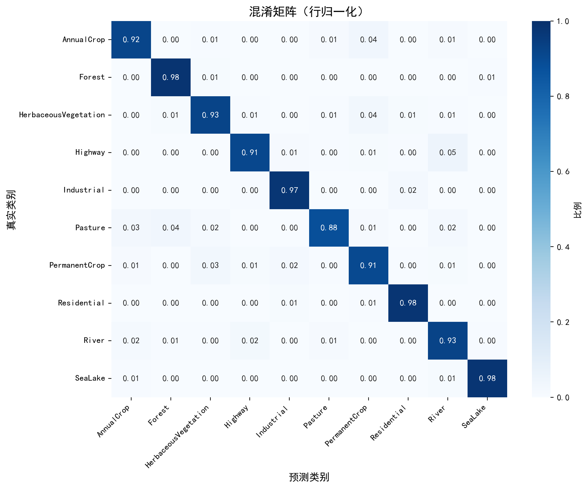
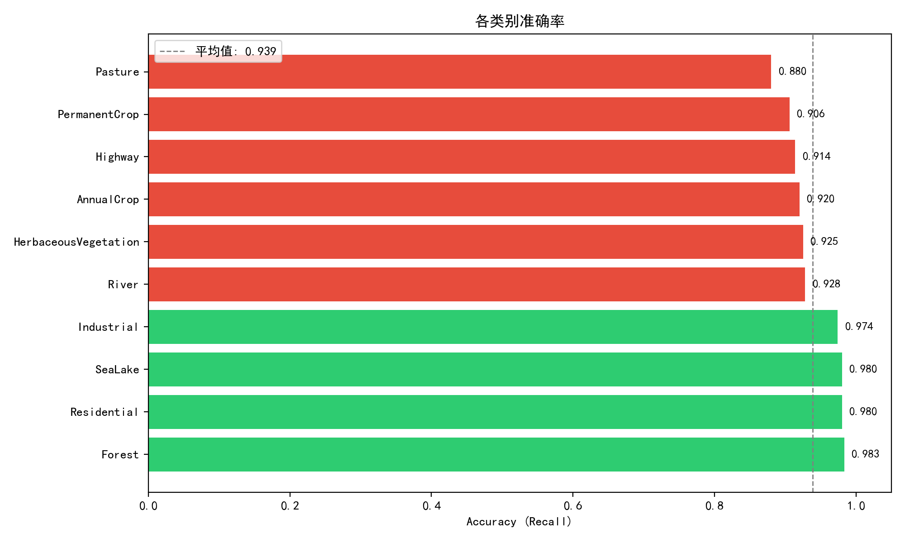

# EuroSAT 卫星影像分类 — 模型评估报告

## 一、整体指标

| 指标 | 数值 |
|------|------|
| Top-1 Accuracy | 0.9419 |
| Top-2 Accuracy | 0.9872 |
| Macro Avg Precision | 0.9405 |
| Macro Avg Recall    | 0.9390 |
| Macro Avg F1        | 0.9395 |

## 二、各类别指标

| 类别 | Precision | Recall | F1 | Support |
|------|-----------|--------|----|---------|
| AnnualCrop | 0.9436 | 0.9200 | 0.9316 | 600 |
| Forest | 0.9562 | 0.9833 | 0.9696 | 600 |
| HerbaceousVegetation | 0.9391 | 0.9250 | 0.9320 | 600 |
| Highway | 0.9501 | 0.9140 | 0.9317 | 500 |
| Industrial | 0.9530 | 0.9740 | 0.9634 | 500 |
| Pasture | 0.9387 | 0.8800 | 0.9084 | 400 |
| PermanentCrop | 0.8865 | 0.9060 | 0.8961 | 500 |
| Residential | 0.9624 | 0.9800 | 0.9711 | 600 |
| River | 0.8889 | 0.9280 | 0.9080 | 500 |
| SeaLake | 0.9866 | 0.9800 | 0.9833 | 600 |

## 三、最易混淆类别对 (Top-3)

1. **Highway** → **River** （混淆率 5.40%）
2. **AnnualCrop** → **PermanentCrop** （混淆率 3.83%）
3. **Pasture** → **Forest** （混淆率 3.75%）

## 四、混淆矩阵

## 五、各类别准确率

